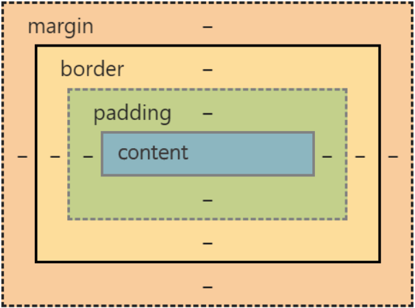

# Checklist 02. CSS의 기초와 응용

## Resources
* [MDN - CSS](https://developer.mozilla.org/ko/docs/Web/CSS)
* [Centering in CSS: A Complete Guide](https://css-tricks.com/centering-css-complete-guide/)
* [A complete guide to Flexbox](https://css-tricks.com/snippets/css/a-guide-to-flexbox/)
* [그리드 레이아웃과 다른 레이아웃 방법과의 관계](https://developer.mozilla.org/ko/docs/Web/CSS/CSS_Grid_Layout/%EA%B7%B8%EB%A6%AC%EB%93%9C_%EB%A0%88%EC%9D%B4%EC%95%84%EC%9B%83%EA%B3%BC_%EB%8B%A4%EB%A5%B8_%EB%A0%88%EC%9D%B4%EC%95%84%EC%9B%83_%EB%B0%A9%EB%B2%95%EA%B3%BC%EC%9D%98_%EA%B4%80%EA%B3%84)

## Checklist
* ### CSS를 HTML에 적용하는 세 가지 방법은 무엇일까요?
  CSS는 웹페이지의 레이아웃, 폰트, 색상 등을 지정하는 데 사용되는데 HTML에 적용하는 방법에는 세가지가 있다.   
  1. __inline:__ 해당 태그의 `style` 속성에 넣는 방식.
      ```html
      <h1 style="color:green;">Hello world</h1>
      ```
  2. __internal css:__ `style` 태그 내부에 기입하는 방식, html파일 전체에 적용하게 된다.
      ```html
      <head>
        <style>
          <!-- 전체 selector, 문서 전체에 적용 -->
          * {  }
          <!-- group selector 만들기, 해당 태그에 모두 적용 -->
          selector1, selector2 { }
          <!-- tag/type selector 만들기, 해당 태그에 모두 적용 -->
          h1 {
            color: green;
          }
          <!-- class selector 만들기 -->
          .main {
            margin: 0 auto;
          }
          <!-- id selector 만들기 -->
          #titleBottom {
            color: grey;
          }
        </style>
      </head>
      <body>
        <header>
          <h1>NAVER</h1>
        </header>
        <section class='main'></section>
        <footer id='titleBottom'>
        </footer>
      </body>
      ```
  3. __external css:__ CSS문서에 style 속성을 지정하고, 그 문서를 html에 link하여 사용하는 방법   
      style.css
      ```css
      @charset "utf-8"; /* 인코딩 언어를 꼭 설정해줘야 한다 */
      /* internal css처럼 selector마다 style을 지정 */
      ```
      index.html
      ```html
      <head>
        <!-- css경로를 넣어줌 -->
        <link rel="stylesheet" href="css/style.css">
      </head>
      <body>
        <!-- internal예제의 body태그에서 했던것처럼 -->
      </body>
      ```
  * ### 세 가지 방법 각각의 장단점은 무엇일까요?
    1. __inline:__ 특정 영역에 스타일을 적용하고 싶을 때 가장 빠른 방법. 하지만 꾸미는데 한계가 있고, 재사용이 불가능하다. 또한 많이 사용하게 되면 html문서의 크기가 커져서 화면에 로딩되는 시간이 길어짐. 그리고 css랑 코드가 섞이면서 유지보수가 어려워 진다.
    1. __internal:__ html문서안의 여러 요소를 한번에 꾸미는게 가능. 그리고 특정 문서에만 스타일 지정이 가능. 이는 장점이자 단점, 다른 문서에서 재사용 불가. 그리고 이 방법 또한 html문서의 크기를 키우게 된다.
    3. __external:__ 여러 html 문서에서 재사용 가능. 웹 전체 스타일을 일관성있게 유지. 변경시에도 일괄적으로 변경가능해서 유지보수에 좋다. 그리고 html문서도 가벼워진다. 때문에 가장 권장하는 방법. 하지만 웹 전체 페이지를 잘 구조화해야 하고 재사용이 가능한 style들을 고안해내야 한다.

<br>

*************

* ### CSS 규칙의 우선순위는 어떻게 결정될까요?
  CSS를 사용하다 보면 여러가지 스타일이 중복되는 경우가 있기 때문에 우선순위를 정하는 규칙이 꼭 필요하다.   
  CSS는 _Cascading Style Sheets_ 의 약자, 여기서 _cascading_ 은 __위에서 아래로 떨어지는__ 또는 __상속, 종속하는__ 이라는 의미를 가진 단어, 즉 CSS에는 캐스케이딩 원리가 적용된다.   
  캐스케이딩은 __스타일 우선순위__ 와 __스타일 상속__ 두가지 원칙을 따른다.
  * __스타일 우선 순위__   
    스타일 우선순위는 다음 3가지 요소를 통해 우선순위를 결정한다.
    1. 중요도: 스타일이 선언된 위치에 따라 우선순위가 결정되는 것.   
       !important(사용자 __>__ 제작자) __>__ 사용자 __>__ 제작자 __>__ 브라우저   
       * !important: 최우선으로 적용해야할 스타일. 하지만 명시도에 영향주고, 종속을 깨뜨려 디버깅을 어렵게 만든다. 될수록 피하자.   
       * 사용자 css: 색약자, 저시력자 등을 위해서 특별히 설정된 스타일. 제작자가 임의로 변경 불가.  
       * 제작자 css: 개발자가 만든 css.   
       * 브라우저 css: 브라우저에 기본으로 설정된 CSS.
    2. 명시도: selector에 따라 우선순위가 결정되는 것. 쉽게 말해 스타일이 적용되는 범위가 좁을수록 우선순위가 높다는 것.   
       !important __>__ inline __>__ id __>__ class __>__ type
    3. 코드순서: 코드에서 가장 마지막에 등장한 속성을 최우선으로.   
  * __스타일 상속__   
    부모 요소의 스타일을 자식 요소가 따라가는 것을 말한다. 즉 부모 요소에 스타일을 지정하면 자식 요소에 따로 지저을 안해줘도 적용이 된다.

************

* ### CSS의 박스모델은 무엇일까요? 박스가 화면에서 차지하는 크기는 어떻게 결정될까요?
  모든 HTML 요소는 box 모양으로 구성되며, 이것을 box model이라고 한다. 박스 모델은 안에서부터 밖으로, content, padding, border, 그리고 margin으로 구분한다.   
     
  * __content:__ 텍스트나 이미지가 들어있는 박스의 실질적인 내용 부분. 
    - height 속성
    - width 속성
  * __padding:__ 내용과 테두리(border) 사이의 간격. 
    - padding 속성: 패딩의 두께, 상, 하, 좌, 우 따로 설정할수 있다.
      >padding-top, padding-bottom, padding-left, padding-right
  * __border:__ 내용와 패딩 주변을 감싸는 테두리.
    - border-style 속성
      >dotted, dashed, solid, double, groove, ridge, inset, outset, none, hidden
    - border-width 속성: border의 두께를 조절
    - border-color 속성
    - border-radius: 박스 모서리 둥글게 만들기
  * __margin:__ 테두리와 이웃하는 요소 사이의 간격. 
    - margin 속성: margin의 두께 조절
      >margin-top, margin-right, margin-bottom, margin-left   

<br>

************

* ### `float` 속성은 왜 좋지 않을까요?
  float 속성은 웹 개발자가 텍스트 내부에 float(떠있는)하는 이미지를 포함하려고 처음 도입되었다. 텍스트가 이미지를 둘러싸고 있는 형태를 나타내는 layout을 구현할수 있었다.
  >float: none / left / right   
  >none: 하나의 줄 영역을 차지하고 나머지 요소들이 상하로 나누어 진다.   
  >left / right: 부모 container의 좌 / 우측에 떠있다.

  하지만 곧 개발자들은 이미지 뿐만 아니라 다른것들도 float할수 있다는걸 깨달았고. drop-cap 같은것을 만들어 내기 시작했다. 이 외에도 여러가지 구조의 layout을 잡을때 사용했다.
  >drop-cap: 한 단락의 첫 글자를 크게 만들어 나머지 문장들에게 둘러싸이게 하는것.   
   
   <br>

  여러가지 테스트를 해보았다.   
  1. block element에만 float 속성을 사용할수 있는데, float되고 나서도 float되기 전에 차지하고 있던 영역은 그대로 존재한다. 이때 float대상요소를 inline element들이 감싸줄 때, 일부분은 float대상요소 원래 영역에 놓일수가 없어서 float대상요소를 둘러싸지 못하고 밑으로 내려간다.
  2. float대상요소를 block element들이 감싸줄 때, 시각적으로는 감싸주고 있는것처럼 보인다. 하지만 이들도 block element이기 때문에, 영역들을 확인해보면 다 한줄씩 차지하고 있다. 그리고 float대상요소는 그 위를 덮고 있다. 이때 크기설정을 잘 못하면 overlap되어서 내용 일부분이 잘릴수도 있을것 같다. 
  3. 만약에 float대상요소 아래에 위치하게 하고 싶은 요소X가 있으면 그 요소안에 `clear: left / right / both`을 넣어줘서 요소X를 밑으로 내려보낸다. 하지만 요소X가 inline element일때는 소용 없었다...
  4. 3번을 해결할때 다른 방식으로 시도했는데, float대상요소와 요소X전에 있는 요소들을 `<div>`와 같은 block element로 묶어줬었다. 소용없었다. 여기서 float대상요소는 부모 container의 영역에서 떠있게(이탈) 되면서 그 영역을 초과하는것을 알수 있었다. 이때 부모 요소에 `display: flow-root`을 넣어줬더니 요소X는 밑으로 내려갔다.

  이처럼 float로 layout을 잡을때 여러가지 예외상황들이 발생하는것 같다. 예전에는 웹 구조의 다양성을 위해 많이 사용되었던 것 같지만, 유지보수하기 어려웠을것 같다. 지금은 flex나 grid같은 더 나은 기술들이 생겼으니 될수록 float는 쓰지 않는게 좋을듯 하다.
   
************

* ### Flexbox(Flexible box)와 CSS Grid의 차이와 장단점은 무엇일까요?
  flex와 grid는 박스모델 display 속성.   
  Display 속성들:   
  * __block:__ 언제나 줄바꿈한다, width가 100%.
    >width, height, margin, padding, border 모두 조절 가능
  * __inline:__ 줄바꿈이 되지 않는다. 요소의 내용만큼 차지. 같은 행에서 요소들을 사이에는 __4px__ 의 여백을 갖는다.
    >width, height는 조절 불가; margin, padding, border의 경우는 좌우만 적용된다.
  * __inline-block:__ inline수준의 block
    >block처럼 모두 조절 가능하고, inline처럼 같은 행에서 요소들 사이에 여백이 있다.
  * __none:__ 화면에 표시되지 않는다. 화면에 해당 요소에 대한 공간을 차지 않는다.
    >그만큼의 공간을 차지하게 하려면 visibility 속성을 hidden으로 설정.
  * __inherit:__ 상위 요소의 display 속성을 상속.
  * __table:__ block-level의 표
  * __inline-table:__ inline-level의 표
  * __list-item:__ 목록의 항목을 bullet과 함께 표시, block-level.
  * __flex:__ 1차원적으로 수평 혹은 수직 중 한가지의 방향으로 영역을 나눠줌. 
    >flex-direction: row(default) 거나 column   
    >단위: 상대적인 단위로 지정
  * __grid:__ 2차원적으로 수평과 수직 방향으로 동시에 영역을 나눠줌. 
    >grid-template-columns으로 수평을   
    >grid-template-rows으로 수직을   
  
  <br>

  Flexbox(Flexible box)와 CSS Grid의 차이와 장단점은 아래와 같다.
  1. Flex는 1차원적인 layout을 제공하고, grid는 2차원적인 layout을 제공한다.
  2. Flex는 유연한 박스 모델로서, 아이템들의 크기와 간격을 자동으로 조절할 수 있다. 따라서 반응형 웹 디자인에 적합하며, 단순한 레이아웃에 사용하기 좋다.
  3. Grid는 행과 열로 이루어진 격자 모양의 레이아웃을 제공. Grid는 복잡한 레이아웃에 사용하기 좋으며, 아이템들이 위치와 크기를 정확하게 지정할수 있다. fr(분수)단위나 repeat()함수 등을 사용하여 유연하게 레이아웃을 구성할 수 있다.

  그래서 outter layout은 flex로 유연하게, inner layout들은 grid로 구체적으로 잡는게 좋다.

************

* ### CSS의 비슷한 요소들을 어떤 식으로 정리할 수 있을까요?
  아래와 같은 방법으로 비슷 요소들을 동시에 적용시킬수 있다. 

  * 속성 선택자: 특정 속성이 있는 요소를 대상으로 지정.
    >__[attr]__ attr 속성이 있는 요소와 일치   
    >__[attr=value]__ 값이 정확히 value인   
    >__[attr~=value]__ 값이 정확히 value거나 공백value공백인   
    >__[attr|=value]__ 값이 정확히 value거나 뒤에 - 붙는 value로 시작하는    
  
  * 하위 문자열 일치 선택자: 속성 값 내에서 하위 문자열의 고급 일치를 허용.
    >__[attr^=value-]__ 값이 value로 시작하는 attr 속성이 있는 요소와 일치.
    >__[attr$=-value]__ 값이 value로 끝나는   
    >__[attr*=value]__ 문자열value문자열 형태의 value를 포함하는

  * 대소문자 구분 선택자: 뒤에 __i__ 를 붙여주면 구분하지 않는다.
    >예를 들면 __[attr=value i]__ 대소문자 구분 안하고 값이 value인 요소와 일치

  * 의사 클래스: 의사 클래스는 특정 상태에 있는 요소를 선택하는 선택자. 앞에 __:__ 를 붙여서 표현.
    >__:first-child__ 부모의 첫번째 자식한테 적용, 자식 요소:first-child{}. ex. article p:first-child {}   
    >__:last-child__   
    >__:nth-child()__
    >__:only-child__   
    >__:invalid-child__

  * 사용자-행동 유사 클래스: 사용자가 어떤 방식으로든 문서와 상호 작용할 때만 적용.
    >__:hover__ ex. a:hover{}   
    >__:focus__
  
  * 의사 요소: 의사 클래스와 비슷하나, 기존 요소에 적용하는것이 아니라 완전히 새로운 HTML 요소를 마크업에 추가한 것처럼 작동. __::__ 을 붙여서 표현.
    >__::first-line__ 부모의 자식들의 첫번째 줄에 적용.   
    >__::before__ 선택자 content 앞쪽에 가상의 content 추가   
    >__::after__ 선택자 content 뒤쪽에 가상의 content 추가

  * 의사 클래스와 의사 요소들의 혼합
    > __:first-child::first-line__ 부모의 첫번째 자식의 첫번째 줄에 적용

  * 후손 결합자: 첫번째 선택자 자손중 두번째 선택자 요소와 일치한 요소에 적용
    >ex. .box p {} box class가 지정된 요소의 자식들 중 p에만 적용
  
  * 자식 결합자: 첫번째 선택자의 직계 자식중 두번째 선택자와 일치하는 요소에 적용. __>__ 으로 연결
    >ex. ul > li {} ul 요소안에 직계 li 요소에 적용

  * 인접 형제 결합자: 첫번째 선택자의 다음 형제요소가 두번째 선택자와 일치할때 그 형제요소에 적용. __+__으로 연결
    >ex. h1 + p 첫번째 제목 바로 다음이 p요소일때 p에 적용
  
  * 일반 형제 결합자: 첫번째 선택자의 뒤에 오는 형제요소중 일치한 형제요소에 다 적용.__~__ 으로 연결
    >ex. h1 ~ p 첫번째 제목 뒤에 있는 모든 p 형제들에 적용

  * 결합자 사용: 선택자들과 연결자들을 DIY해서 결밥!!!

