# Quest 06. 인터넷의 이해

## Introduction
* 이번 퀘스트에서는 인터넷이 어떻게 동작하며, 서버와 클라이언트, 웹 브라우저 등의 역할은 무엇인지 알아보겠습니다.

## Topics
* 서버와 클라이언트, 그리고 웹 브라우저
* 인터넷을 구성하는 여러 가지 프로토콜
  * IP
  * TCP
  * HTTP
* DNS

## My Resources
* [MDN](https://developer.mozilla.org/ko/docs/Learn/Common_questions/Web_mechanics/How_does_the_Internet_work)
* [Youtube - Aaron](https://www.youtube.com/watch?v=7_LPdttKXPc)
* [정보통신기술용어해설](http://www.ktword.co.kr/index.php)

## Checklist
* ### 인터넷은 어떻게 동작하나요? Internet Protocol Suite의 레이어 모델에 입각하여 설명해 보세요.
  인터넷은 웹의 핵심기술, 컴퓨터들이 서로 통신 가능한 거대한 네트워크이다. 인터넷을 지원하는 다양한 기술은 시간이 지남에 따라 진화해 왔지만 작동 방식은 그다지 변하지 않았다. 두가지 주요 개념: `패킷`과 `프로토콜`.     
  >`패킷`은 데이터를 일정 크리고 자른것. 데이터는 전송될때 작은 패킷들로 분할되고 안에는 헤더와 해당 데이터에 대한 정보가 모두 포함된다. 패킷이 목적지에 도착하면 수신 장치에서 순서대로 재조립된 다음 데이터가 사용되거나 표시된다. 
  <br>   
  `프로토콜`은 네트워크에서 통신할 때 그 방법에 대한 공통의 약속, 규칙을 말한다. Internet Protocol Suite(Internet Protocol Stack)은 그런 통신규약(protocol)들의 모음이다. 그중에서 TCP(Transmission Control Protocol)와 IP(Internet Protocol)가 가장 많이 쓰이기 때문에, TCP/IP 4계층 이라고도 불린다.    

  <br>  

  __Internet Protocol Suite의 Layer Model__  
  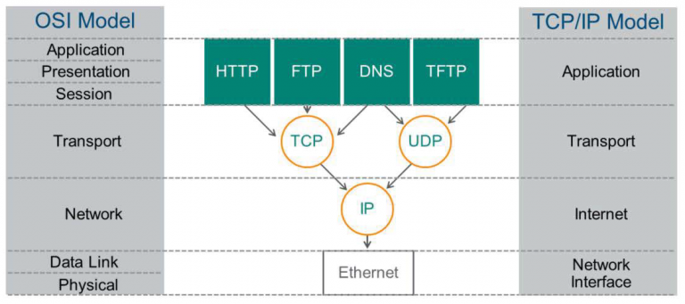

  `Application`: 응용프로그램들이 네트워크서비스, 메일서비스, 웹서비스 등을 할수 있도록 표준적인 인터페이스를 제공. 사용자와 마주하고, 데이터를 생성, 데이터를 알맞은 포맷으로 배치, 세션 관리. 
  >__HTTP:__ Web Browser같은 응용프로그램을 통해 Web-client와 Web-Server 사이에서 데이터를 전송하는 프로토콜.     
  >__HTTPS:__ HTTP 암호화나 인증 등의 구조를 더한것.     
  >__FTP:__ 파일 전송 프로토콜.    
  >__DNS:__ 도메인 주소를 IP주소로 변환시켜주는 프로토콜, vice versa.     
  >__TFTP:__ FTP의 보안 기능이 없는 파일 전송 단순 프로토콜.      
  >__SMTP:__ email을 보내고 받는 프로토콜.    

  `Transport`: 전송되는 데이터의 목적지 확인, 오류가 발생시 재전송을 담당. 애플리케이션을 식별하기 위해서 포트 번호를 사용.    
  >__TCP:__ 연결 지향적 프로토콜. 전송할 데이터를 여러개의 패킷들로 나누고 반대편에서 패킷들을 재조립, 데이터가 각단의 응용프로그램들에 의해 교환되는 시간동안 연결이 확립되고 유지.       
  >__UDP:__ 비 지향적 프로토콜. TCP와 달리 패킷으로 나누거나 반대편에서 재조립하지 않는다.    

  `Internet`: IP주소를 사용하여 어떤 네트워크의 주소인지, 목적지 네트워크로 전송.   
  >__IP:__ TCP/IP 기반의 인터넷 망을 통하여 데이터 전달을 담당하는 프로토콜. 패킷의 완전한 전달을 보장하지 않는다.          

  `Network Interface`: 하드웨어적인 요소와 관련되는 모든 것을 지원. 같은 IP주소 안에서 컴퓨터 고유의 MAC(Media Access Control)주소를 가지고 목적 컴퓨터로 찾아간다.  데이터가 2진법인 전기 주파수(비트)로 바뀌어서 전송된다.        
  >__Ethernet:__ 현재 전세계적으로 90%이상 사용되는 대표적인 네트워크 형태. 이더넷에 접속되어 있는 장치들은 어느때라도 데이터를 전송할수 있다. CSMA/CD 기반이 대부분.   
  >__WIFI:__ 150m 안에서 전파나 적외선으로 전송.    
  >__Bluetooth:__ 보통 10m 안에서 전파로 전송. WLAN과 동일한 주파수를 사용.   
  >__NFC:__ 10cm 이내 거리에서 13.56MHz 주파수로 통신. 교통카드 등에서 사용.             
  >__지그비:__ IEEE 802.15.4-2003을 기반으로. 화재 및 도난, 빌딩 자동화 등에서 사용.               

  * #### 근거리에서 서로 떨어진 두 전자기기가 유선/무선으로 서로 통신하는 프로토콜은 어떻게 동작할까요? 
    LAN에서 전자기기들은 유선이나 무선으로 서로 통신할수 있다.     
    
    네트워크에 연결하는 물리적 장치에는 반드시 하나 이상의 LAN 카드가 있는데, LAN 카드는 전송매체에 접속하는 역할과 데이터의 입출력 및 송수신, 프로토콜의 처리 기능을 담당한다. 두 전자기기가 근거리에 서로 존재하고 있고 모두 LAN카드를 내장하고 있다면, 이더넷 케이블(UTP)로 직접 연결해서 통신하면 된다. 이더넷은 빛의 매질로 생각했던 에테리(Ether)에서 유래하였고 근거리 통신망에 사용하기 위해 개발된 기술이다. 지금은 IEEE 802.3 규약으로 표준화하였다. 이더넷은 네트워크 장치마다 부여하는 mac 주소를 가지고 실제 물리 회선을 통해 캡슐화된 데이터를 주고 받는것을 담당한다.

    모바일 디바이스같은 경우에는 무선으로 통신해야 하는데, 가장 일반적으로 사용되는 프로토콜 중 하나가 wifi이다. 인터넷 신호가 흐르는 유선 인터넷 신호를 기반으로 한 wifi는 회선에 무선 공유기(액세스 포인트, AP)를 설치하여, 인터넷 신호를 무선 신호으로 바꿔서 뿌려주는 원리를 가지고 있다. Wifi 통신은 IEEE 802.11 표준에 따라 동작한다. 그리고 이더넷처럼 출발지 및 목적지 MAC 주소를 포함한 패킷들을 주고받는다.     

    이더넷이나 wifi는 주로 CSMA/CA 방식을 기반으로 하는데, 충돌을 방지하고 효율적으로 데이터를 전송한다. 데이터를 전송하기 전에 다른 장치가 전송 중인지 확인하고 전송중인 데이터가 있다면 임의의 시간 동안 대기한다.  

  * #### 근거리에 있는 여러 대의 전자기기가 서로 통신하는 프로토콜은 어떻게 동작할까요?
    근거리에 여러대의 전자기기가 서로 통신할때는 허브라는 네트워크 접속장치를 사용한다. 허브는 여러개의 입력과 출력 포트가 있는데, 한 포트에서 수신된 신호들은 허브의 다른 모든 포트로 즉시 재전송되며, 모든 입력과 출력은 서로 연결되어 있다. (물리 계층에서 작동)     

    스위치도 네트워크 접속장치이다. 허브와 다른 점이라면, OSI 모델의 Data Link 계층에서 작동한다. 수신한 패킷 헤더를 읽어 의도한 대상을 식별할수 있기 때문에 수신하기로 되어 있는 컴퓨터에만 해당 패킷을 보낸다. 스위치는 이더넷, 파이버 채널, ATM 및 인피니밴드 등을 기반으로 하는데, 현재는 대부분의 스위치가 이더넷을 사용한다.  

    두개 이상의 근거리 통신망을 연결하고 싶을 때는 브리지라는 장치를 사용할수 있는데, 수신지 주소에 따라 특정 네테워크 트래픽만 통화시킬수 있도록 설계된 특수한 형태의 네트워크 스위치이다. 예를 들어 각 부서의 PC들이 부서 단위 별로 LAN을 구성하고 있을 때 부서간의 LAN을 브릿지로 연결할수 있다.        

  * #### 아주 멀리 떨어져 있는 두 전자기기가 유선/무선으로 서로 통신하는 프로토콜은 어떻게 동작할까요?
    종류가 다른 두개 이상의 네트워크를 상호 접속하여 정보를 주고받을 때는 게이트웨이를 사용해야 한다. 게이트웨이는 네트워크의 입구이자 출구이다. 브리지와 달리 서로 다른 프로토콜 통신망 간에도 프로토콜을 변환하여 정보를 주고받을수 있다. 게이트웨이는 OSI 모델의 어느 곳에서도 동작이 가능하다(Session 계층).   

    다른 네트워크로부터 전송된 패킷은 먼저 게이트웨이로 간다. 게이트웨이는 패킷의 헤더 정보를 확인하고 목적지 IP 요청에 따라 프로토콜 변환을 수행한다. 이후 패킷은 라우터로 전달된다. 라우터는 IP 주소를 확인하고 다른 네트워크로 패킷을 전달한다. 라우터는 이처럼 컴퓨터 네트워크 간에 데이터 패킷을 전송하는 네트워크 장치다. 패킷의 위치를 추출하여, 그 위치에 대한 최적의 경로를 지정하며, 이 경로를 따라 데이터 패킷을 다음 장치로 전달한다. (Network/Internet 계층과 Transport 계층)   

    __컴퓨터 ↔ 라우터 ↔ 모뎀 ↔ 전화시설 ↔ ISP (↔ ISP) ↔ 전화시설 ↔ 모뎀 ↔ 라우터 ↔ 컴퓨터__    
    >* 라우터(Router): 컴퓨터에서 보내진 메세지가 올바른 대상 컴퓨터에 도착하는지 확인
    >* 모뎀(MOEM): 네트워크의 정보를 전화 시설에서 처리할 수 있는 정보로 바꿔준다, vice versa.   
    >* ISP(Internet Service Provider): 모두 함께 연결되는 몇몇 특수한 라우터를 관리. SK텔레콤, KT, LG U+    

  * #### 두 전자기기가 신뢰성을 가지고 통신할 수 있도록 하기 위한 프로토콜은 어떻게 동작할까요?   
    응용계층:    
    >HTTPS: HTTP는 HTML을 전송하기 위한 통신 규약. 암호화되지 않은 방법으로 데이터를 전송. 이를 보완하기 위해 등장한것이 HTTPS. SSL 프로토콜 위에서 돌아가는 프로토콜.     

    표현계층:     
    >SSL: 암호화와 압축을 수행. 보안과 성능상의 이유로 대칭키, 공개키 이 두가지 암호화 기법을 사용.     

    전송계층:    
    >TCP: 3-way-handshaking 과정을 통해 연결을 설정하며 높은 신뢰성을 보장. 흐름 제어 및 혼잡 제어.    

    네트워크 계층:   
    >ICMP: TCP/IP에서 IP 패킷을 처리할때 발생되는 문제에 대한 보고 발생. 진단의 역할.      

    데이터 링크 계층:    
    >MAC: 이 계층은 point to point 간 신뢰성 있는 전송을 보장하기 위한 계층. MAC은 네트워크의 인터페이스에 할당된 고유의 식별주소. NIC(Network Interface Controller)를 만든 회사에서 할당하며 하드웨어에 저장한다.

  * #### HTTP는 어떻게 동작할까요?   
    client: 브라우저    
    server: 웹 서버 / 웹 어플리케이션 서버    

    `1.` 사용자가 웹 브라우저에 이동하려는 사이트 주소(URL) 입력.    
    `2.` DNS 서버에 웹 서버의 호스트 이름을 IP 주소로 변경 요청.     
    `3.` client TCP와 웹 서버 연결 시도. 3-wayhandshake       
          Client -> Server : TCP에서 [SYN](임의로 생성된 시퀀스 번호)를 전달.      
          Server -> Client : [SYN ACK]을 TCP에 전달.     
          Client -> Server : TCP에서 [ACK] 를 전달. 요청이 수락됨.  
    `4.` Request: 서버에게 GET 명령 전송.    
         GET /index.html HTTP/1.1               -> 요청문     
         Host : www.daum.net                            	-> 헤더     
         Body :                         -> (Get 요청이기 때문에 body가 없다)     
    `5.` Response: 서버가 client에게 웹 문서 회신.       
         HTTP/1.1 200 OK					           -> 상태문   
         Date: Thu, 12 Feb 2009 06:29:38 GMT 	            -> 헤더 시작     
         Server: Apache/1.3.29 (Unix) PHP/4.3.4RC3     
         X-Powered-By: PHP/4.3.4RC3     
         Transfer-Encoding: chunked        
         Content-Type: text/html				           -> 헤더 끝    
         html 코드...      							          -> body      
    `6.` Close: 서버 - client 연결 해제. 4-way-handshake     
         Client -> Server : FIN     
	       Server -> Client : ACK      
	       Server -> Client : FIN      
	       Client -> Server : ACK   
    `7.` 브라우저가 웹 문서 출력.

    <br>   

    Request 구조:      
    * 요청문       
	    * 요청메소드: GET, POST, PUT, DELETE, HEAD, OPTIONS, TRACE     
	    * URL: 접근 프로토콜://IP주소 또는 도메인 이름/문서의 경로/문서 이름    
	    * HTTP 버전     
    * 헤더     
    * 바디: 요청메소드가 POST나 PUT을 사용하게 됐을 떄 들어오게 됨.

    Response 구조:     
    * 상태문
	    * HTTP 버전 
	    * 상태코드 200은 성공, 404는 찾을수 없음.
	    * 상태이름
    * 헤더 
    * 바디
         

* ### 우리가 브라우저의 주소 창에 www.knowre.com 을 쳤을 때, 어떤 과정을 통해 서버의 IP 주소를 알게 될까요?    
  브라우저는 URL을 해독하거나 HTTP 메시지를 만드는 것까지는 진행하지만, 네트워크에 송출하는 기능이 없기 때문에 OS에 의뢰하여 송신하게 된다. 이때, URL 내부에 있는 서버의 도메인명에서 IP 주소를 조사하게 된다.     

  IP 주소를 통해 도메인명을 알수 있고, 그 반대로도 동작 가능하게 하는것이 바로 DNS 서버이다. DNS 서버에 조회 메세지를 보내고 거기에서 반송되는 메세지를 받는다. 이건 DNS 서버에 대해 client로 동작하는 것인데, 이러한 DNS client가 resolver라고 부른다. 그리고 DNS의 원리를 이용하여 IP 주소를 조사하는 것이 name resolution이다. 리졸버는 Socket 라이브러리에 들어있는 부품 프로그램이다. Socket 라이브러리는 캘리포니아대학교의 버클리 캠퍼스에서 만든 BSD라는 UNIX OS의 파생 버전으로 개발된 C 언어용 라이브러리이며, 인터넷에서 사용하는 많은 기능이 Socket 라이브러리를 이용하여 개발되었다. 고로 도메인명에서 IP 주소를 조사할 때 브라우저는 Socket 라이브러리의 리졸버를 이용한다.    

  브라우저의 주소 창에 www.knowre.com 을 쳤을 때, 브라우저에서는 리졸버를 호출하고, 리졸버가 DNS 서버에 조회 메시지를 보내고, DNS 서버에서 응답 메시지가 돌아온다. 이 응답 메시지 속에 IP 주소가 포함되어 있으므로 리졸버는 이를 추출하여 브라우저에서 지정한 메모리 영역에 넣게되며, 브라우저가 웹 서버에 메시지를 보낼때는 이 메모리 영역에서 IP 주소를 추출하여 HTTP의 리퀘스트 메시지와 함께 OS에 건네주어 송신을 의뢰하게 된다. 이때 OS의 내부에 포함된 프로토콜 스택을 호출하여 실행을 의뢰하게 된다.


## Quest
* ### tracert(Windows가 아닌 경우 traceroute) 명령을 통해 www.google.com 까지 가는 경로를 찾아 보세요.
  ```
  traceroute www.google.com
  traceroute to www.google.com (142.250.196.132), 64 hops max, 52 byte packets   
  1  192.168.200.254 (192.168.200.254)  5.073 ms  2.125 ms  2.298 ms
  2  1.222.161.1 (1.222.161.1)  8.805 ms  6.165 ms  6.224 ms
  3  49.142.20.237 (49.142.20.237)  3.374 ms  5.534 ms  2.513 ms
  4  49.142.20.9 (49.142.20.9)  2.676 ms  4.067 ms  4.741 ms
  5  111.118.20.169 (111.118.20.169)  7.600 ms  7.269 ms  7.974 ms
  6  192.145.251.168 (192.145.251.168)  37.302 ms  35.690 ms  43.600 ms
  7  * * *
  8  108.170.242.193 (108.170.242.193)  35.531 ms  121.299 ms
     108.170.235.120 (108.170.235.120)  44.114 ms
  9  108.170.242.177 (108.170.242.177)  35.753 ms
     nrt12s36-in-f4.1e100.net (142.250.196.132)  41.050 ms
     142.250.224.213 (142.250.224.213)  35.345 ms
  ```
  
  * #### 어떤 IP주소들이 있나요? 그 IP주소들은 어디에 위치해 있나요?
    192.168.200.254 - my router's address     
    1.222.161.1 - public IP 주소, 사용자는 Seoul, 서울 특별시, 대한민국     
    49.142.20.237            
    111.118.20.169      
    192.145.251.168 - Winona, 미네소타, 미국          
    108.170.242.193 - Mountain View, 캘리포니아, 미국     
    108.170.235.120      
    108.170.242.177      
    142.250.196.132     
    142.250.224.213        

    [IPSHU](https://ko.ipshu.com/)

* ### Wireshark를 통해 www.google.com 으로 요청을 날렸을 떄 어떤 TCP 패킷이 오가는지 확인해 보세요
  ```
  traceroute www.google.com
  nslookup www.google.com => ip address 알아내서 wireshark filtering 하기 
  ```    
  3-way handshake 과정: 

  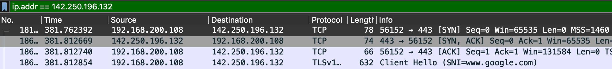

  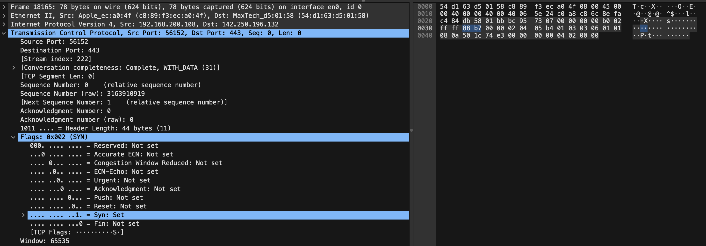

  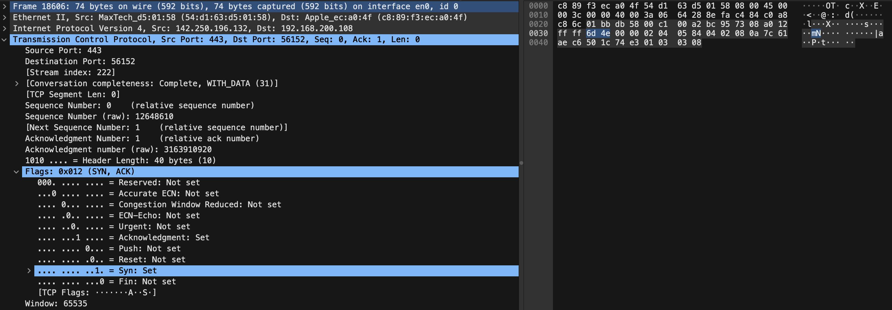

  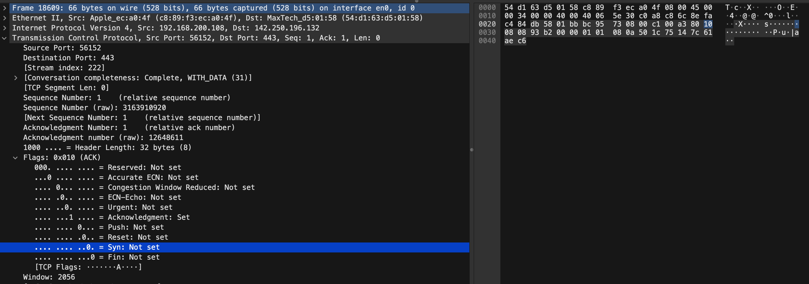   

  4-way handshake 과정:     

  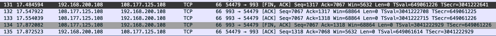  

  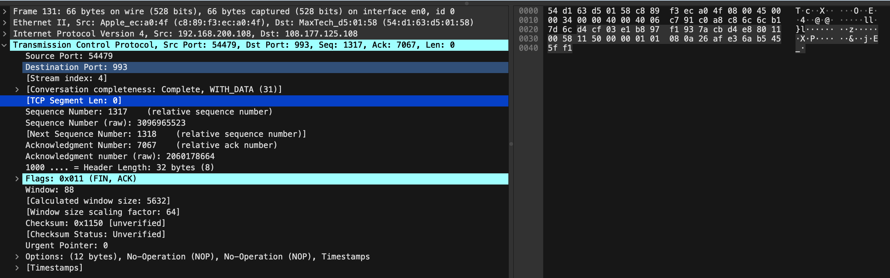    

  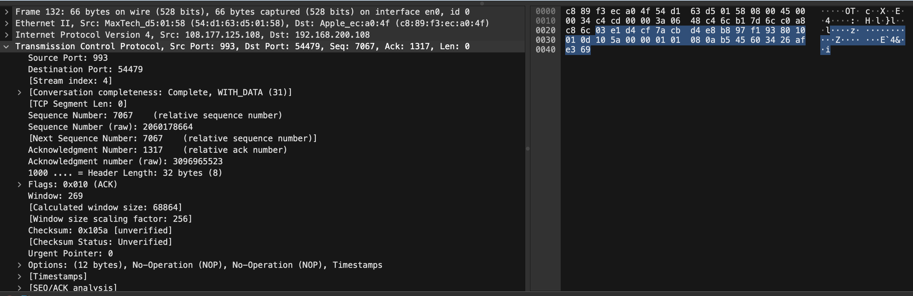    

  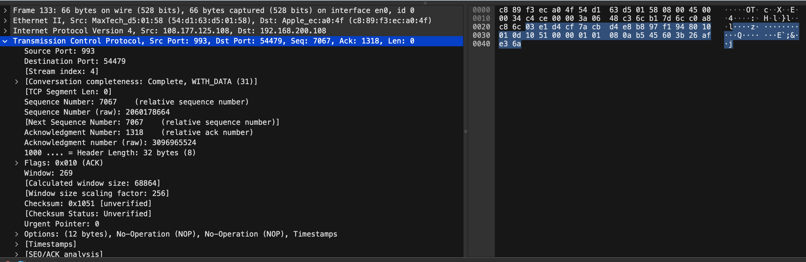    

  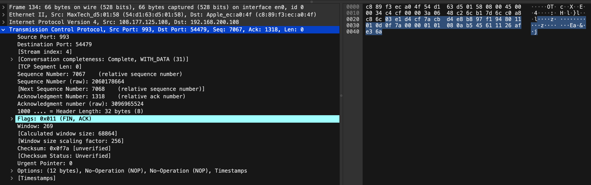   

  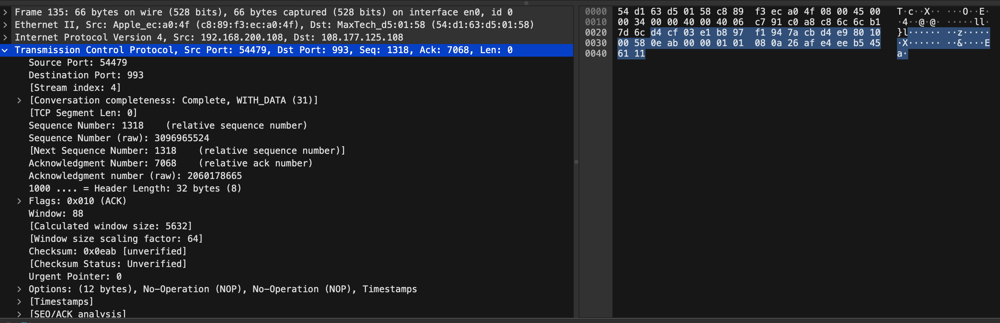   


  * #### TCP 패킷을 주고받는 과정은 어떻게 되나요?
    TCP Segment Length: 0        

    3-way handshake 과정:   
    SYN = 1, ACK = 0 => 연결 패킷 (연결 요청)      
    SYN = 1, ACK = 1 => 연결 수신 통지 (연결 요청 응답)   
    SYN = 0, ACK = 1 => 데이터 또는 ACK 패킷
    1. Client가 SYN = 1(set), Seq = 0 으로 Server에 connection을 request한다. 이때 ACK = 0, Header Length = 44 bytes (11), Length = 78 bytes.    
    2. Server에서 SYN = 1, Seq = 0 으로 Client에 수락을 보내준다. 이때 ACK = 1, Header Length = 40 bytes (10), Length = 74 bytes. 
    3. Client가 SYN = 0(not set), Seq = 1을 Server에 보낸다. 이때 ACK = 1, Header Length = 32 bytes (8), Length = 66 bytes.        

    4-way handshake 과정:     
    1. Client가 연결을 종료하겠다는 FIN flag를 Server에 전송.    
    2. Server에서는 FIN flag를 받고 일단 알겠다는 ACK 메세지를 Client에 보냄.  
    3. Server에서 연결 종료가 되면 준비되었음을 알리기 위해 FIN flag를 Client에 보냄.     
    4. Client에서 해지 준비가 되었다는 ACK 메세지를 Server에 보냄.

  * #### 각각의 패킷에 어떤 정보들이 담겨 있나요?    
    __Scr port:__ 보내는 쪽     
    __Dst port:__ 받는 쪽       
    __Seq:__ 순차번호, 최소로 전송될때 임의로 만들어 줌. 시퀀스 번호 덕분에, 수신자는 쪼개진 세그먼트의 순서를 파악하여 올바른 순서로 데이터를 재조립할수 있다. 순차번호는 패킷에 포함되어 있는 데이터 만큼 증가하게 된다.    
    __SYN:__ 접속요청. 1인 경우 Seq는 초기 순서 번호, 0인 경우 Seq는 Segment 순서 번호.      
    __ACK:__ 요청 수락 메세지, 연결 설정/해제 과정중에는 `상대방이 보낸 Seq 번호 + 1`. 실제 데이터를 주고 받을 때는 `상대방이 보낸 시퀀스 번호 + 자신이 받은 데이터의 bytes`. 만약에 Client에서 Segment Length = 100 byte, Seq = 1 의 패킷을 보냈다면, Server에서는 ACK = 100 + 1 = 101 을 보내야 한다.    
    __FIN:__ 송신 종료    

* ### telnet 명령을 통해 http://www.google.com/ URL에 HTTP 요청을 날려 보세요.
  ```
  ahjin@Jins-MacBook-Pro ~ % telnet www.google.com 80
  Trying 142.250.196.132...
  Connected to www.google.com.
  Escape character is '^]'.
  GET / HTTP/1.1

  HTTP/1.1 200 OK
  Date: Wed, 06 Dec 2023 03:15:48 GMT
  Expires: -1
  Cache-Control: private, max-age=0
  Content-Type: text/html; charset=ISO-8859-1
  Content-Security-Policy-Report-Only: object-src 'none';base-uri 'self';script-src 'nonce--jDBoYFVZZoN6ATDYxT2Pg' 'strict-dynamic' 'report-sample' 'unsafe-eval' 'unsafe-inline' https: http:;report-uri https://csp.withgoogle.com/csp/gws/other-hp
  P3P: CP="This is not a P3P policy! See g.co/p3phelp for more info."
  Server: gws
  X-XSS-Protection: 0
  X-Frame-Options: SAMEORIGIN
  Set-Cookie: 1P_JAR=2023-12-06-03; expires=Fri, 05-Jan-2024 03:15:48 GMT; path=/; domain=.google.com; Secure
  Set-Cookie: AEC=Ackid1QPj1nGmfGDFE_nOvdqyKH5EMi8A3_mAWP17fZnJfLufPcOsecuq0c; expires=Mon, 03-Jun-2024 03:15:48 GMT; path=/; domain=.google.com; Secure; HttpOnly; SameSite=lax
  Set-Cookie: NID=511=LnGRFx3dWykOiNAotnXgumCyt8zWcE0Q6nPuQBVvJBoSFnr4tO0tSZRsnjMyPhtVERONldpUfKfsRTZ9Dukxr57yLaF-uu9zzkjBrhrwBfgH75Vehu6PA6_jfhb93xMnPiqHPnPC8V39apmQ7AYoJYFxMu035L7_qUugYhR7qHA; expires=Thu, 06-Jun-2024 03:15:48 GMT; path=/; domain=.google.com; HttpOnly
  Accept-Ranges: none
  Vary: Accept-Encoding
  Transfer-Encoding: chunked

  334b
  <!doctype html>
  <html>
  블라블라
  </html>
  0
  ```

  * #### 어떤 헤더들이 있나요? 그 헤더들은 어떤 역할을 하나요?
    __Date:__ 메세지가 발생한 날짜와 시간   
    __Expires:__ 응답이 완료되었다고 고려되는 날짜/시간    
    __Cache-Control:__ 요청과 응답 모두에서의 캐싱 메커니즘을 명시하는 지시문   
    __Content-Type:__ 리소스의 미디어 타입      
    __Content-Security-Policy-Report-Only:__ 웹 개발자가 정책을 강제로 적용하지 않고도 그 효과를 실험해 볼수 있게 해줌. 이러한 위반 보고서는 HTTP `POST` 요청을 통해 지정된 URL로 전송된 JSON 문서로 구정됨.       
    __P3P:__ 응답의 쿠키에 포함된 컴팩트 정책 관련 정보            
    __Server:__ 요청을 처리하기 위해 오리진 서버에 의해 사용되는 소프트웨어에 대한 정보    
    __X-XSS-Protection:__ 교차-사이트 스크립팅 필터링을 활성화 함     
    __X-Frame-Options:__ 브라우저가 `<frame`, `<iframe>`, `<embed>`, `<object>`에서 페이지 렌더링을 허용해야 하는지를 나타냄    
    __Set-Cookie:__ 서버에서 유저 에이전트로 쿠키를 전송    
    __Accept-Ranges:__ 서버가 범위 요청을 지원하는가를 나타냄, 지원할 경우 범위가 표현될수 있는 단위를 나타냄    
    __Vary:__ 오리진 서버로부터 새로운 요청을 하는 대신 캐시된 응답을 사용할지를 결정하기 위한 향후의 요청 헤더를 매칭할 방법을 정함.    
    __Transfer-Encoding:__ 사용자에게 엔티티를 안전하게 전송하기 위해 사용할 인코딩 형식을 지정     

    [MDN](https://developer.mozilla.org/ko/docs/Web/HTTP/Headers)          