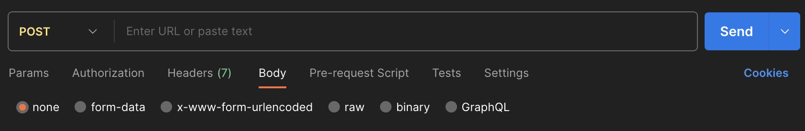
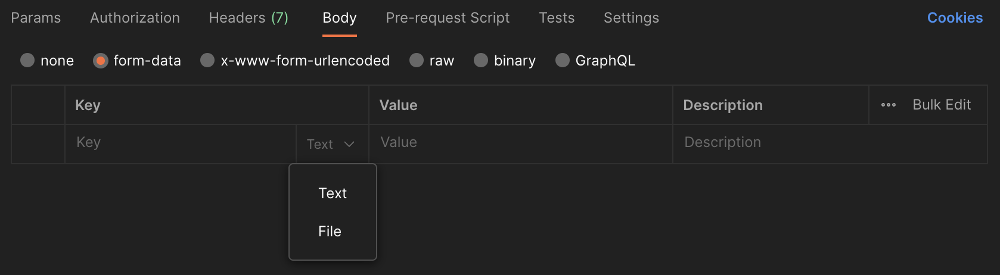
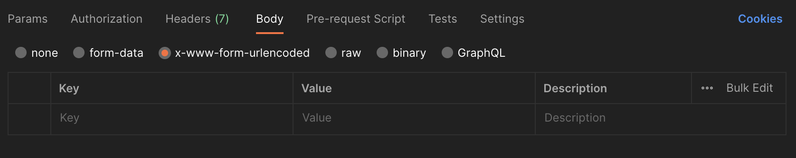
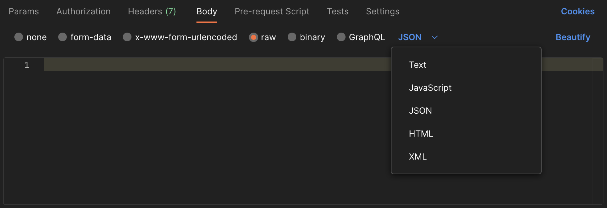
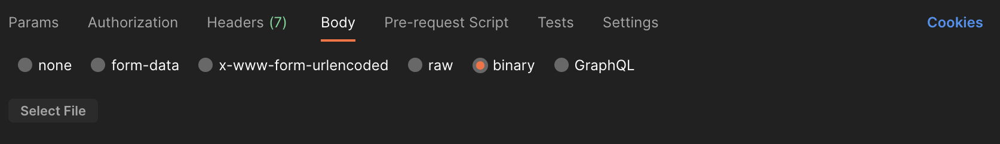
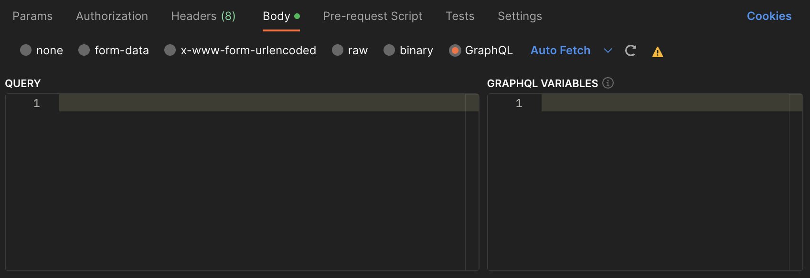

# Checklist 08. 웹 API의 기초

## HTTP의 GET과 POST 메소드는 어떻게 다른가요?
  __`GET`__ 데이터 요청, 주로 검색하는데 사용.    

  1. 캐싱된다. 서버에 리소스를 요청할 때 웹 캐시가 요청을 가로채 서버로부터 리소스를 다시 다운로드하는 대신 리소스의 복사본을 반환한다. HTTP 헤더에서 cache-control 헤더를 통해 캐시 옵션을 지정할 수 있다.   
  2. 브라우저 히스토리에 남는다.    
  3. 북마크 될 수 있다.   
  4. 길이 제한이 있다. 브라우저마다 제한이 다르다.
  5. 요청하는 데이터를 쿼리 문자열에 담아서 보내기 때문에 HTTP 메세지에 body가 없다.
  6. 중요한 정보를 다루면 안된다. 쿼리 파라미터에 다 노출되어 버리기 때문.   

  __`POST`__ 데이터 전송, 주로 새로 생성, 업데이트에 사용 (회원가입, 로그인 등등).    

  1. 캐싱되지 않는다.    
  2. 브라우저 히스토리에 남지 않는다.     
  3. 북마크 되지 않는다.    
  4. 데이터 길이에 제한이 없다.   
  5. 쿼리 문자열을 요청 HTTP 메세지 body 부분에 넣어서 보낸다.

  * ### 다른 HTTP 메소드에는 무엇이 있나요?
    * __`PUT`:__ 리소스를 대체(덮어쓰기), 해당 리소스가 없으면 생성
    * __`PATCH`:__ 리소스 부분 변경
    * __`DELETE`:__ 리소스 삭제
    * __`HEAD`:__ `GET` 메서드의 요청과 동일한 응답을 요구하지만, 응답 본문을 제외
    * __`CONNECT`:__ 대상 자원으로 식별되는 서버에 대한 터널을 설정
    * __`OPTIONS`:__ 대상 리소스에 대한 통신 가능 옵션(메서드)을 설명(주로 CORS에서 사용)
    * __`TRACE`:__ 대상 리소스에 대한 경로를 따라 loop-back 테스트 수행
    
## HTTP 서버에 GET과 POST를 통해 데이터를 보내려면 어떻게 해야 하나요?
  __`GET`__ 데이터 요청, 주로 검색하는데 사용.    
  1. __정적 데이터 조회 과정:__ 이미지, 정적 text 문서. 쿼리 문자열 없이 리소스 경로로 단순하게 조회 가능.    
 
     >GET _리소스 경로_ HTTP/1.1    
     >Host:     

  2. __동적 데이터 조회 과정:__ 주로 검색, 게시판 목록에서 검색어로 이용. 쿼리 문자열을 사용해서 데이터를 전달. 쿼리 문자열은 key1=value1&key2=value2 구조로 되어 있음.    

     요청 URL 뒤에 _?문자열_ 을 줘서 상세한 조회 데이터를 얻는다.      
     >GET _리소스 경로?username=이름&age=숫자_ HTTP/1.1    
     >Host:           

  3. __HTML Form 데이터 조회 과정:__ HTML Form 태그 문서로 사용자와 UI로 상호작용하여 서버와 통신. 

     지정한 GET 메소드 동작에 따라 태그안에 들어간 값들이 쿼리 문자열로 서버로 전송된다.
     ```html
     <form action="" method="get">     
      <input type="text" name="username" />
      <input type="text" name="age" />
      <button type="submit">전송</button>     
     </form>
     ```    
     >GET _리소스 경로?username=이름&age=숫자_ HTTP/1.1    
     >Host:      

  __`POST`__ 데이터 전송, 주로 새로 생성, 업데이트에 사용 (회원가입, 로그인 등등).    
  1. __JSON 데이터 전송 과정:__ 메시지 바디(body)를 통해 서버로 요청 데이터 전달하면 서버는 요청 데이터를 처리하여 업데이트.    

     Client는 body에 정보를 담아 JSON 형태로 만들어 담고 서버로 전송. 
     ```json
     {
        key1: value1,
        key2: value2
     }
     ```

  2. __HTML Form 데이터 전송 과정:__ HTML Form 태그 문서로 서버에 데이터 전송.

     웹문서에서 폼 입력칸에 데이터를 적고 전송 버튼을 누른다.     
     지정한 POST 메소드 동작에 따라 태그안에 들어간 값들이 쿼리 문자열로 서버로 전송된다.    
     ```html
     <form action="/save" method="post">     
      <input type="text" name="username" />
      <input type="text" name="age" />
      <button type="submit">전송</button>     
     </form>
     ```    
     >POST /save HTTP/1.1    
     >Host:     
     >Content-Type: application/x-www-form-urlencoded    
     >username=이름&age=숫자    

     Step3. Server는 받은 메세지를 분석해 로직 대로 처리. 데이터베이스에 새로 등록하거나 등등.   

  3. __파일 데이터 전송 과정:__ HTML Form 태그 문서로 서버에 데이터 전송. 바이너리 데이터 전송시 사용. 

     웹문서에서 폼 입력칸에 데이터를 적고, file을 선택해서 전송 버튼을 누른다.    
     enctype을 "multipart/form-data" 로 작성해 해당 Form에 파일이 있다는 것을 표시.    

     ```html
     <form action="/save" method="post" enctype="multipart/form-data">     
      <input type="text" name="username" />
      <input type="text" name="age" />
      <input type="file" name="file1" />
      <button type="submit">전송</button>     
     </form>
     ```    
     >POST /save HTTP/1.1    
     >Host:     
     >Content-Type: multipart/form-data; boundary=-----XXX =>     
     >Content-Length:      
     >
     >-----XXX
     >Content-Disposition: form-data; name="username"    
     >      
     >이름    
     >-----XXX
     >Content-Disposition: form-data; name="age"    
     >      
     >나이    
     >-----XXX     
     >Content-Disposition: form-data; name="file1"; filename=""     
     >Content-Type: image/png        
     >
     >2o493lrrlwr....     
     >-----XXX--    


  * ### HTTP 요청의 `Content-Type` 헤더는 무엇인가요?
    Client에게 반환된 컨텐츠의 유형이 실제로 무엇인지를 알수 있기 위한 존재.  

    1. Multipart Related MIME 타입
       * multipart/related <-- 기본형태  
    2. XML Media의 타입
       * text/xml
       * application/xml
    3. Application의 타입 
       * application/javascript
       * application/octet-stream  : <-- 디폴트 미디어 타입은 운영체제 종종 실행파일, 다운로드를 의미
       * application/json <-- JSON
       * application/x-www-form-urlencode <-- HTML Form 형태, 데이터를 url encoding 처리
    4. Multipart 타입
       * multipart/form-data  <-- 파일 첨부
    5. TEXT 타입 
       * text/html
       * text/javascript
       * text/plain <-- txt
    6. file 타입
       * application/msword <-- doc
       * application/pdf <-- pdf
       * application/zip <-- zip
       * image/jpeg <-- jpeg, jpg, jpe

  * ### Postman에서 POST 요청을 보내는 여러 가지 방법(`form-data`, `x-www-form-urlencoded`, `raw`, `binary`) 각각은 어떤 용도를 가지고 있나요?
    POSTMAN은 API를 개발, 테스트, 공유 및 문서화하는데 사용되는 API 클라이언트 이다. 엔드 포인트 URL을 입력하는 테스트에 사용되며 서버로 요청을 보내고 서버에서 응답을 받아 api가 잘 동작하는지 확인할 수 있다.

      

    * `form-data`: form 태그 내부에 wrapping된 데이터를 보낼때. Key-Value 쌍으로 보냄. 파일 첨부(multipart/form-data) 요청을 보낼때 자주 사용됨.
         

    * `x-www-form-urlencoded`: 'form-data' 와 비슷하나 url이 전송될때 인코딩된다.
      
    
    * `raw`: 가장 많이 사용되는 옵션. 요청 본문을 문자열로 전송.
      

    * `binary`: 요청 본문을 2진 데이터로 전송. 파일,이미지, 동영상 등등 수동으로 작성할수 없는 것들.
      

    * `GraphQL`: Facebook에서 만든 어플리케이션 레이어 쿼리 언어. POST만 지원. Client가 여러개의 자원이 필요할때, 여러개의 api를 호출하는 대신 GraphQL으로 한번의 요청으로 정보를 응답받을수 있다.
      

## node.js의 `http` 모듈을 통해 HTTP 요청을 처리할 때,
  * ### `req`와 `res` 객체에는 어떤 정보가 담겨있을까요
    `http` 모듈은 node.js에서 가장 기본적이고 중요한 웹 모듈이다. 웹서버와 클라이언트 생성등 관련된 모든 기능을 담당한다. 대표적으로 `server` 객체, `request` 객체, `response` 객체 등이 있다.
    
    [nodejs](https://nodejs.org/docs/latest/api/http.html#class-httpclientrequest)

    * `req`: request객체, http.IncomingMessage 객체에 전달된다. 요청에 대한 정보, 기능을 담고있다.
      * request.url 
      * request.path // Include query string if necessary
      * request.host // Default 'localhost'
      * request.port // Default 80
      * request.protocol // Default: 'http:'
      * request.headers
      * request.method // Default 'GET'
      * request.write(chunk[, encoding][, callback])
      * request.end([data[, encoding]][, callback])
      * request.setHeader(name, value)
      * request.getHeader(name)
      * request.getHeaderNames()
      * request.getHeaders()
      * request.removeHeader(name)
      * request.setTimeout(timeout[, callback])
      * request.on(event type, callback) // [참고](https://nodejs.org/api/events.html)
      
    * `res`: response객체, 응답에 대한 정보를 담고있다.
      * response.statusCode  // Default: 200
      * response.statusMessage
      * response.req // A reference to the original HTTP request object
      * response.sendDate
      * response.writeHead(statusCode[, statusMessage][, headers]) // 200, 404, ...
      * response.write(chunk[, encoding][, callback])    // body
      * response.end([data[, encoding]][, callback])
      * response.setHeader(name, value)
      * response.getHeader(name)
      * response.getHeaderNames()
      * response.getHeaders()
      * response.setTimeout(msecs[, callback])
      * response.on(eventName, callback) // [참고](https://nodejs.org/api/events.html)

  * ### GET과 POST에 대한 처리 형태가 달라지는 이유는 무엇인가요?
    데이터 형태와 가져오는 방식이 다르다.   
    * `GET`은 url을 통해 데이터를 요청. 안에 query string이 들어갈수 있고, body부분은 비어있다. 때문에 url을 통해 데이터를 가져온다.     
      ```js
      import http from 'http';
      import url from 'url';
      const server = http.createServer((req, res) => {
         const parsedUrl = url.parse(req.url, true);  // 데이터 형태가 string.
         const { pathname, query } = parsedUrl;
         const value = query.name;
         res.end(`key: ${value}`);
         ...
      });
      ```
      properties of a parsed url: 
      ```JSON
      {    
         protocol: 'https:',    
         slashes: true,
         auth: null,
         host: 'www.example.com:8080',
         port: '8080',
         hostname: 'www.example.com',
         hash: '#section',
         search: '?name=John&age=30',
         query: { name: 'John', age: '30' },
         pathname: '/path/to/resource',
         path: '/path/to/resource?name=John&age=30',
         href: 'https://www.example.com:8080/path/to/resource?name=John&age=30#section'
      }
      ```
    
    * `POST`는 url이 아닌 body를 통해 데이터를 요청. 때문에 body 부분을 통해 데이터를 가져온다.
      ```js
      import http from 'http';
      const server = http.createServer((req, res) => {
         let data = '';
         req.on('data', (chunk) => {  // body 부분, POST / PUT
            data += chunk;  // stream, 순차적인 데이터
         });
         req.on('end', () => {
            const parsedData = JSON.parse(data); // 데이터 형태가 json 일때, 
            //
            ...
         });
      });
      ```

## 만약 API 엔드포인트(URL)가 아주 많다고 한다면, HTTP POST 요청의 `Content-Type` 헤더에 따라 다른 방식으로 동작하는 서버를 어떻게 정리하면 좋을까요? 
모듈화를 하면 좋다.   
API 엔드포인트에 따른 각각의 handler을 만든다.     
`Content-Type`에 따른 각각의 handler를 만든다. 매개변수에 API 엔드포인트 handler 함수를 넣어준다.   
main post handler를 만든다. Inner function에는 `Content-Type` handler들이 있다.    
그리고 반복되는 코드들을 정리한다. (예를 들면 에러 처리 같은~)    

1. API 엔드포인트에 따른 handler 파일들을 각각 만들어준다.  
   user:
   ```js
   // handlers/pathname/user/user.js
   export function handlePost(req, res, data) {
      ...

      res.writeHead(201, { 'Content-Type': 'application/json' });
      res.end(JSON.stringify({ message: 'User created successfully' }));
   }
   ```

   products:
   ```js
   // handlers/pathname/product/product.js
   export function handlePost(req, res, data) {
      ...

      res.writeHead(201, { 'Content-Type': 'application/json' });
      res.end(JSON.stringify({ message: 'Product created successfully' }));
   }
   ```

   else:     
   ```js
   ...
   ```

2. Content-Type에 따라 POST handler 파일들을 각각 만들어준다.    
   JSON POST request:
   ```js
   // handlers/contentType/json/json-post.js
   export function handleJSONPost(req, res, handler) {
      let data = '';
      req.on('data', (chunk) => {
         data += chunk;
      });

      req.on('end', () => {
         try {
            const jsonData = JSON.parse(data);
            handler(req, res, jsonData);
         } catch (error) {
            res.writeHead(400, { 'Content-Type': 'application/json' });
            res.end(JSON.stringify({ error: 'Invalid JSON data' }));
         }
      });
   }
   ```

   application/x-www-form-urlencoded POST request
   ```js
   // handlers/contentType/form-urlencoded/form-urlencoded-post.js
   export function handleFormURLEncodedPost(req, res, handler) {
      let data = '';
      req.on('data', (chunk) => {
         data += chunk;
      });

      req.on('end', () => {
         const formData = parseFormURLEncodedData(data);
         handler(req, res, formData);
      });
   }
   // Helper function to parse application/x-www-form-urlencoded data
   export function parseFormURLEncodedData(data) {
      const parsedData = {};
      const pairs = data.split('&');

      for (const pair of pairs) {
         const [key, value] = pair.split('=');
         parsedData[decodeURIComponent(key)] = decodeURIComponent(value);
      }

      return parsedData;
   }
   ```

   else:     
   ```js
   ...
   ```

3. main POST handler 파일을 만든다.    
   안에서 Content-Type에 따라 만든 POST handler들을 부르고 있다.
   ```js
   // handlers/post-handler/post-handler.js
   export async function handlePostRequest(req, res, handler) {
      const contentType = req.headers['content-type'] || '';

      switch (contentType) {
         case 'application/json':
            const handleJSONPost = await import('./handlers/contentType/json/json-post.js');
            handleJSONPost(req, res, handler);
            break;

         case 'application/x-www-form-urlencoded':
            const handleFormURLEncodedPost = await import('./handlers/contentType/form-urlencoded/form-urlencoded-post.js');
            handleFormURLEncodedPost(req, res, handler);
            break;

         // Add more cases for other Content-Types as needed
         default:
            res.writeHead(415, { 'Content-Type': 'application/json' });
            res.end(JSON.stringify({ error: 'Unsupported Media Type' }));
      }
   }
   ```

4. server 파일을 만든다.      
   안에서 contentType 파일들과 main POST handler 파일을 부르고 있다.
   ```js
   // server.js
   import http from 'http';
   import url from 'url';

   // route handler 들을 부르기
   import handlePostRequest from './handlers/post-handler/post-handler.js';

   const server = http.createServer((req, res) => {
      const parsedUrl = url.parse(req.url, true);
      const { pathname } = parsedUrl;
      const method = req.method.toLowerCase();

      // Route the request 
      if (pathname === '/users' && method === 'post') {
         import usersHandler from './handlers/pathname/user/user.js';
         handlePostRequest(req, res, usersHandler);
      } else if (pathname === '/products' && method === 'post') {
         import productsHandler from './handlers/pathname/product/product.js';
         handlePostRequest(req, res, productsHandler);
      } else {
         // Handle 404 for unsupported routes
         res.writeHead(404, { 'Content-Type': 'application/json' });
         res.end(JSON.stringify({ error: 'Not Found' }));
      }
   });

   // Start the server on port 3000
   const PORT = 8080;
   server.listen(PORT, () => {
      console.log(`Server is running on port ${PORT}`);
   });
   ```

  * ### 그 밖에 서버가 요청들에 따라 공통적으로 처리하는 일에는 무엇이 있을까요? 이를 어떻게 정리하면 좋을까요?
    * Parse the Request    
      >HTTP 메소드, headers, url 등등을 서버가 알아들을수 있게 파싱. 
    * Routing
      >HTTP 메소드와 함께 어떤 handler/controller을 부를지 결정.
    * Middleware Execution
      >요청과 응답 사이에서 미들웨어 함수들을 필요에 따라 부름.
    * Authentication and Authorization
      >인증 및 권한 관리
    * Request Handling
      >어플리케이션의 로직이 들어있고 요청을 처리하고 응답을 만드는 handler들 부름.
    * Error Handling
      >에러 처리. 에러 메세지를 보냄.
    * Send Response
      >요청한 데이터를 client한테 보내줌.
    * Logging
      >모든 요청, 응답들을 추적. 디버깅, 모니터링, 성능 분석에 중요.
    * Connection Management
      >client와의 원활한 통신을 관리.
    * Clean Up
      >필요에 따라, 다음 요청을 위해 필요한 정리작업을 수행.

      Router, middlewave, handler/controller 를 잘 활용하면 좋다. 공통적으로 처리해야 하는 작업들을 모듈화해서, 필요할때마다 불러쓰면, 리팩토링에도 좋고, 코드 재사용률이 좋아진다.