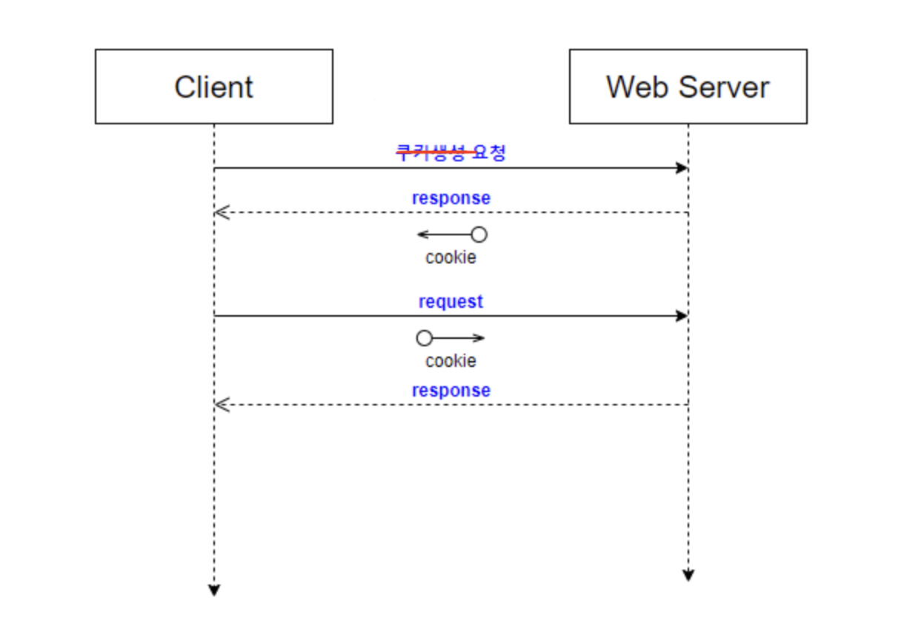
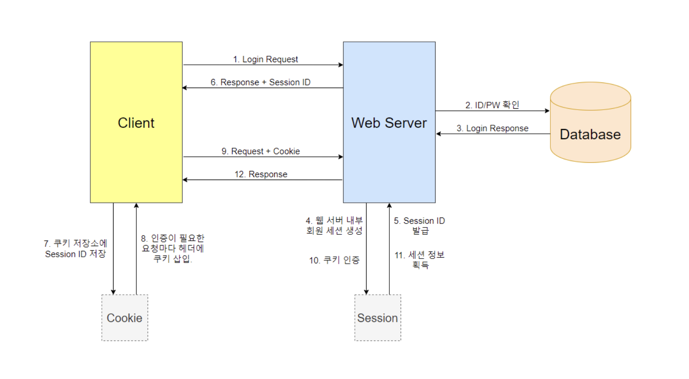
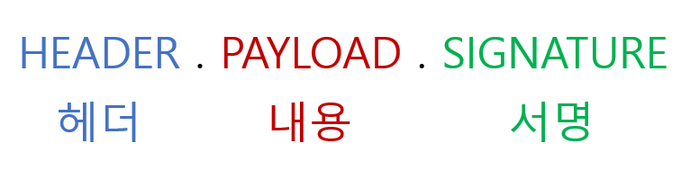
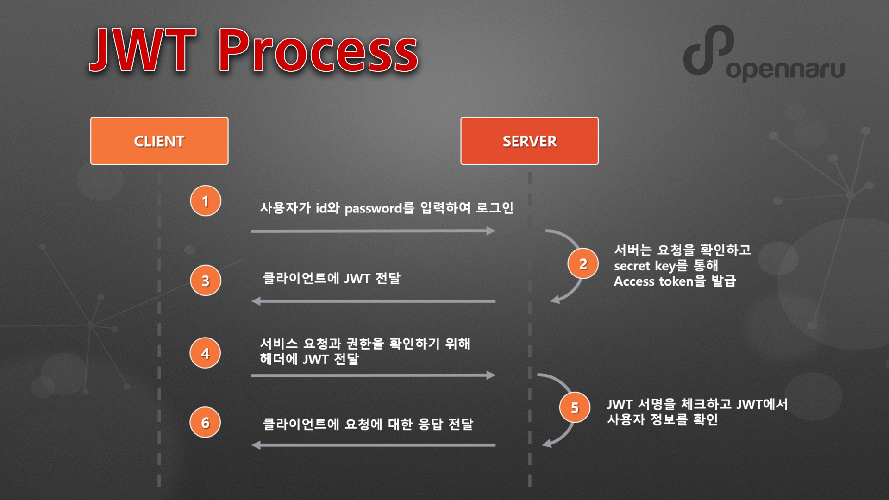

# Checklist 10. 인증의 이해

# 쿠키란 무엇일까요?
  쿠키는 방문한 웹사이트에서 생성된 파일로(key-value 형식의 문자열), 방문에 관한 정보를 저장하여 온라인 환경을 더 편리하게 이용하도록 해준다. 웹사이트 재방문시 효율적으로 서비스를 제공하기 위해 사용하며, 서비스 개선을 위한 통계자료로 활용하고, 광고에도 사용한다. 우리는 쿠키를 통해 사이트에서 로그인 상태를 유지하고 사이트 환경설정을 기억하며 지역 관련 콘텐츠를 제공받을 수 있다.

  쿠키는 발행 주체에 따라 퍼스트 파티(first-party) 쿠키와 서드 파티(third-party) 쿠키로 나뉜다. 퍼스트 파티 쿠키는 사용자가 이용중인 웹 사이트 소유자가 직접 생성하는 쿠키이다. 웹 사이트 소유자는 서비스 운영과 마케팅 등에 이를 활용한다. 서드 파티 쿠키는 제3자가 발행한 쿠키이다. 사용자의 행동을 파악해 이를 맞춤형 광고의 타켓팅에 활용한다. 에드 테크 기업들은 웹사이트를 넘나들며 사용자의 행동을 파악해 왔다. 

  쿠키는 사용 목적에 따라 필수 쿠키, 성능 쿠키, 기능 쿠키, 타켓팅 쿠키 네가지로 나뉠수 있다. 필수 쿠키는 로그인, 장바구니, 결제 등 사용자가 웹사이트의 핵심기능을 사용하는데 있어 필수적으로 사용해야 하는 쿠키이다. 성능 쿠키는 사용자의 웹사이트 이용 정보를 수집해 서비스를 효율적으로 개선하는데 사용한다. 기능 쿠키는 사용자의 언어, 지역 등의 정보를 저장하여 사용자에게 최적화된 서비스를 제공할수 있도록 한다. 타겟팅 쿠키는 사용자에게 광고 컨텐츠를 제공하는데 사용한다. 서드 파티 쿠키와 가장 연관된 쿠키이다.

  * ## 쿠키는 어떤 식으로 동작하나요?
    우리가 브라우저를 통해 어떤 페이지에 처음 접속하거나 서비스를 이용할때, 서버는 쿠키를 만들어 브라우저에 보내준다. 그러면 이 쿠키는 브라우저에 저장된다. 브라우저는 이 쿠키를 저장해 가지고 있다가, 서버에 정보를 요청할 때 쿠키에 저장된 정보를 같이 보내준다. 서버는 이 쿠키를 확인해 현재 상태를 파악하고 이에 따른 정보를 보내주는데 이것이 다시 브라우저를 통해 보여진다. 만약 서버가 쿠키정보를 수정해 보내주면 이는 다시 브라우저에 저장된다. 이렇게 정보를 주고받는 과정은 API를 통해 이루어진다. 

    쿠키의 구성 요소는 다음과 같다.  
    1. 키: 쿠키를 식별하는데 사용되기 때문에 중복된 키는 존재할수 없다.
    2. 값: 알파벳과 숫자로 이루어지며, 크기는 대부분의 브라우저에서 4,096바이트로 제한되어 있다.
    3. 도메인: 현재 쿠키가 어떤 서버로 전송되어야 하는지를 지정한다. 따로 명시하지 않는다면 쿠키가 생성된 서버로만 전송된다.
    4. 경로: 명시한 경로와 그 하위 경로에만 쿠키가 전송된다. 보통은 루트 경로를 의미하는 "/"로 지정한다.
    5. 기한: 명시된 만료일이 되면 쿠키는 삭제된다. 만료 날짜를 지정하지 않는다면, 브라우저가 종료될때 해당 값은 사라지며 이런 쿠키를 세션 쿠키라고 한다. 로그인 유지, 2단계 인증 생략과 같이 오랫동안 유지되어야 하는 쿠키의 경우 기한을 30년, 50년과 같이 아주 길게 설정한다. 이런 쿠키를 영속 쿠키라고 한다.
    6. 보안요소: Secure (생략시 http, https를 구분하지 않고 전송; 명시시 https인 경우에만 전송), HttpOnly (HTTP전송에서만 사용, 브라우저에서 쿠키에 접근할 수 없도록 제한), SameSite (요청 도메인과 쿠키에 설정된 도메인이 같은 경우에만 쿠키 전송) 등이 있다.

    하지만 쿠키는 브라우저에 직접 저장되기 때문에 보안에 좋지 못하다. 따라서 민감한 개인 정보의 저장에는 사용하지 않는다.

  * ## 쿠키는 어떤 식으로 서버와 클라이언트 사이에 정보를 주고받나요?
    
    1. 클라이언트가 페이지를 요청한다. (HTTP 요청)
    2. 서버에서 쿠키를 생성한다. HTTP 헤더에 쿠키(`Set-cookie`)를 포함시켜 응답한다. (HTTP 응답)
    3. key-value 형태로 웹 브라우저의 쿠키 저장소에 저장한다. 브라우저가 종료되어도 쿠키 만료 기간이 있다면 보관하고 있는다.
    4. 같은 요청을 할 경우 HTTP 헤더에 쿠키를 함께 보낸다.
    5. 서버에서 쿠키를 읽어 이전 상태 정보를 변경 할 필요가 있을 때 쿠키를 업데이트하여 변경된 쿠키를 HTTP 헤더에 포함시켜 응답한다. 

# 웹 어플리케이션의 세션이란 무엇일까요?
  쿠키는 네트워크를 통해 전달되기 때문에 중간에 쿠키를 탈취할 수 있다는 취약점이 있다. 이를 보완하고자 우리는 세션(Session) 을 사용한다. 세션도 마찬가지로 클라이언트의 상태를 저장할 수 있다. 쿠키와 다른 점은 쿠키는 각 브라우저의 별도 쿠키 저장소에 저장되는 반면에 세션은 서버에 저장이 된다. 실제 정보는 서버에만 저장해두고, 브라우저에는 암호회된 키값(Session ID)만 보내고, 그 키값으로 실제 값에 접근할수 있도록 한다. 웹 브라우저가 서버에 접속해서 브라우저를 종료할 때까지 인증상태를 유지하며, 접속 시간에 제한을 두어 일정 시간 응답이 없다면 정보가 유지되지 않게 설정이 가능하다.

  * ## 세션의 ID와 내용은 각각 어디에 저장되고 어떻게 서버와 교환되나요?
  

  1. 클라이언트가 서버에 접속 시 세션 ID를 발급받는다.
  2. 클라이언트는 세션 ID에 대해 쿠키를 사용해 저장해서 가지고 있는다.
  3. 클라이언트는 서버에 요청 시, 이 쿠키의 세션 ID를 서버에 전달한다.
  4. 서버는 세션 ID를 전달받아서 별도의 작업없이 세션 ID로 세션에 있는 클라이언트 정보를 가져온다.
  5. 클라이언트 정보를 가지고 서버 요청을 처리하여 클라이언트에게 응답한다.  

# JWT란 무엇인가요?
  보통 서버가 클라이언트 인증을 확인하는 방식은 대표적으로 쿠키, 세션, 토큰 3가지 방식이 있다. 그중 토큰 기반 인증 시스템은 클라이언트가 서버에 접속을 하면 서버에서 해당 클라이언트에게 인증되었다는 의미로 '토큰'을 부여한다. 이 토큰은 유일하며 토큰을 발급받은 클라이언트는 또 다시 서버에 요청을 보낼 때 요청 헤더에 토큰을 심어서 보낸다. 그러면 서버에서는 클라이언트로부터 받은 토큰을 서버에서 제공한 토큰과의 일치 여부를 체크하여 인증 과정을 처리하게 된다. 
  
  기존의 세션기반 인증은 서버가 파일이나 데이터베이스에 세션정보를 가지고 있어야 하고 이를 조회하는 과정이 필요하지만, 토큰은 세션과는 달리 서버가 아닌 클라이언트에 저장되기 때문에 메모리나 스토리지 등을 통해 세션을 관리했던 서버의 부담을 덜 수 있다. 토큰 자체에 데이터가 들어있기 때문에 클라이언트에서 받아 위조되었는지 판별만 하면 되기 떄문이다. 
  
  JWT(JSON Web Token)란 인증에 필요한 정보들을 암호화시킨 JSON 토큰을 의미한다. 그리고 JWT 기반 인증은 JWT 토큰(Access Token)을 HTTP 헤더에 실어 서버가 클라이언트를 식별하는 방식이다.

  JWT 구조:   

  
  1. Header: 해시 암호화 알고리즘과 토큰의 타입으로 구성되어 있다.
     ```js
     {
      "alg": "HS256",
      "typ": "JWT"
     }
     ```
  2. Payload: 토큰에 담을 클레임(claim) 정보를 포함하고 있다. Payload에 담는 정보의 한 ‘조각’을 클레임이라고 부르고, 이는 name/value 의 한쌍으로 이뤄져 있다. 토큰에는 여러개의 클레임 들을 넣을 수 있다. 클레임에는 [registered](https://datatracker.ietf.org/doc/html/rfc7519#section-4.1)(등록된 클레임, 3글자로 정의, 필수는 아니나 사용이 권장; iss, exp, sub, aud 등), [public](https://www.iana.org/assignments/jwt/jwt.xhtml)(공개 클레임, 사용자가 자유롭게 정의, 충돌을 방지하려면 IANA JSON 웹 토큰 레지스트리에 정의돼 있거나 충돌이 방지된 네임스페이스를 포함하는 URI로 정의), private(비공개 클레임, 정보를 공유하기 위해 만들어진 커스터마이징된 클레임) 세가지가 있다.
     ```js
     {
      "sub": "subject",
      "https://helloworld.com": true,
      "username": Ava Kim
     }
     ```
  3. Signature: secret key를 포함하여 암호화되어 있다. Header, Payload를 Base64 URL-safe Encode를 한 이후 Header에 명시된 해시함수를 적용하고, 개인키(Private Key)로 서명한 전자서명이 담겨있다.
     ```
     HMACSHA256(  
      base64UrlEncode(header) + "." +  
      base64UrlEncode(payload), 
      secret
     )
     ```

  * ## JWT 토큰은 어디에 저장되고 어떻게 서버와 교환되나요?
    

    1. 사용자가 id와 password를 입력하여 로그인을 시도한다.
    2. 서버는 요청을 확인하고 secret key를 통해 Access token을 발급한다.
    3. JWT 토큰을 클라이언트에 전달한다. 클라이언트는 토큰을 브라우저의 로컬스토리지나 쿠키에 저장한다.
    4. 클라이언트에서 API을 요청할때 클라이언트가 Authorization header에 Access token을 담아서 보낸다.
    5. 서버는 JWT Signature를 체크하고 Payload로부터 사용자 정보를 확인해 데이터를 반환한다.
    6. 클라이언트의 로그인 정보를 서버 메모리에 저장하지 않기 때문에 토큰기반 인증 메커니즘을 제공한다. 인증이 필요한 경로에 접근할 때 서버측은 Authorization 헤더에 유효한 JWT 또는 존재하는지 확인한다. 처음 사용자를 등록할 때 Access token과 Refresh token이 모두 발급되어야 한다.

# 세션에 비해 JWT가 가지는 장점은 무엇인가요? 또 JWT에 비해 세션이 가지는 장점은 무엇인가요?
  JWT 장점:   
  1. Header와 Payload를 가지고 Signature를 생성하므로 데이터 위변조를 막을 수 있다.
  2. 인증 정보에 대한 별도의 저장소가 필요없다.
  3. 클라이언트쪽에서 관리하기 때문에(서버는 무상태(StateLess), 상태정보를 저장하지 않음), 서버 확장성이 우수해질 수 있다. 어떤 서버로 유저의 요청이 들어가던 상관없다. 반면 서버 기반일 때, 유저는 처음 로그인했었던 '그' 서버에만 요청을 보내도록 설정을 해야한다.
     >서버의 확장이란, 단순히 서버의 사양을 업그레이드하는 것이 아니라, 여러대의 서버 컴퓨터를 추가하는 것을 의미. 
  4. 토큰 기반으로 다른 로그인 시스템에 접근 및 권한 공유가 가능하다. (쿠키와 차이) 예를 들면 구글 계정으로 다른 웹서비스에 로그인 하는것과 같은 것.
  5. 모바일 어플리케이션 환경에서도 잘 동작한다. (모바일은 세션 사용 불가능)

  세션의 장점:
  1. 세션 ID만 저장하기 때문에 JWT보다 저장공간을 적게 차지한다.
  2. JWT는 토큰의 Payload에 3종류의 클레임을 저장하기 때문에, 정보가 많아질수록 토큰의 길이가 늘어나 네트워크에 부하를 줄 수 있다. 하지만 세션은 세션 ID만 주고 받기 때문에 부하가 적다.
  3. 서버에 저장되기 때문애 보안성이 높다.
  4. 브라우저 종료와 함께 사라지기 때문에 보안성이 높다.
  5. 토큰은 클라이언트 측에서 관리하고 저장하기 때문에, 토큰 자체를 탈취당하면 대처하기가 어렵게 된다. 하지만 세션은 서버측에서 관리하고 ID만 주고 받기 때문에 그럴 위험이 적다.

  다음과 같은 상황에서 JWT 가 유용하게 사용 될 수 있다.
  1. 상태를 저장하지 않는 REST API와 같은 환경
  2. 회원 인증: JWT를 사용하는 가장 흔한 시나리오. 사용자가 로그인 되어있는지 안되어있는지 신경 쓸 필요가 없고, 사용자가 요청을 했을때 토큰만 확인하면 되므로 세션 관리가 필요 없어서 서버 자원과 비용을 절감할 수 있다. 
  3. 정보 교류: JWT는 두 개체 사이에서 안정성있게 정보를 교환하기에 좋은 방법이다. 그 이유는, 정보가 서명이 되어있기 때문에 정보를 보낸이가 바뀌진 않았는지, 또 정보가 도중에 조작되지는 않았는지 검증할 수 있다.

