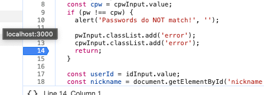
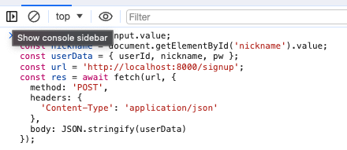
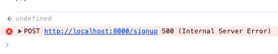
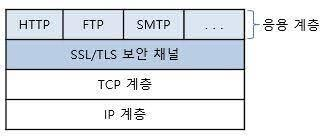

# Quest 12. 보안의 기초

# Introduction
이번 퀘스트에서는 가장 기초적인 웹 서비스 보안에 대해 알아보겠습니다.

# Topics
* XSS, CSRF, SQL Injection
* HTTPS, TLS

# Resources
* [The Basics of Web Application Security](https://martinfowler.com/articles/web-security-basics.html)
* [Website Security 101](https://spyrestudios.com/web-security-101/)
* [Web Security Fundamentals](https://www.shopify.com.ng/partners/blog/web-security-2018)
* [OWASP Cheat Sheet Series](https://cheatsheetseries.owasp.org/)
* [Wikipedia - TLS](https://en.wikipedia.org/wiki/Transport_Layer_Security)

# Checklist
## 입력 데이터의 Validation을 웹 프론트엔드에서 했더라도 서버에서 또 해야 할까요? 그 이유는 무엇일까요?
일반적으로 웹 프론트엔드에서 입력 데이터의 유효성 검사를 하는 이유에는, 해당 값이 비어있는지, 잘못된 값이 입력되었는지 등등이 있다. 예를 들어 회원가입 서비스를 구현할때, 비어있는 입력창이 있는지, 입력한 비밀번호와 재입력한 비밀번호가 일치한지, 등을 확인해서 사용자에게 알맞는 에러 메세지를 띄워준다. 하지만 관련 로직을 프론트엔드 쪽에서만 넣어주면 위험하다.

실험을 해보면: 
1. 크롬의 `Sources`창을 열어서 break point를 걸고, 입력창에 invalid한 값을 넣는다.       


2. break point가 걸린 라인에서 멈출때, `Console`창에 유효성 검사를 피할수 있는 코드를 넣어서 브레이크를 넘어간다.


3. 서버로 회원의 정보가 넘어가고 서버측에서 status code 500인 response를 받는다.    


이처럼 프론트엔드의 검증코드는 회피할 수 있고, 사용자의 입력값 역시 조작 가능하다. 때문에 프론트와 백엔드 양쪽에 모두 검증 코드를 작성하거나, 백엔드에 검증 코드를 작성 후, 백엔드 결과에 따라 프론트는 메세지만 노출하는 방식으로 해야 한다. 개인적으로 생각했을 때 제일 좋은 솔루션은 프론트에서 최대한의 유효성 검사를 통과한 케이스만 서버로 보내주는 것인것 같다. 서버에서 한번 더 유효성검사를 함으로서 보안성을 높이고, client와 server의 데이터의 일관성을 유지할수 있다.

## 서버로부터 받은 HTML 내용을 그대로 검증 없이 프론트엔드에 innerHTML 등을 통해 적용하면 어떤 문제점이 있을까요?
`textContent`와 달리 `innerHTML` 프로퍼티는 텍스트 포함 HTML 마크업이 포함된 문자열을 그대로 적용하거나 반환한다. 요소 노드의 `innerHTML` 프로퍼티에 문자열을 할당하면 요소 노드의 모든 자식 노드가 제거되고 할당한 문자열에 포함되어 있는 HTML 마크업이 파싱되어 요소 노드의 자식 노드로 DOM에 반영된다. 이처럼 `innerHTML` 프로퍼티를 사용해서 DOM을 조작할수 있다. 하지만 이는 보안에 취약하다. 사용자로부터 입력받은 데이터를 그대로 `innerHTML` 프로퍼티에 할당할때, 만약에 HTML 마크업 내에 자바스크립트 악성 코드가 포함되어 있다면 파싱 과정에서 그대로 실행될 가능성이 있기 때문이다. XSS가 그 대표이다.

HTML5는 `innerHTML` 프로포티로 삽입된 script 요소내의 자바스크립트 코드를 실행하지 않는다. 하지만 script 요소 없이도 XSS 공격은 가능하다. 예를 들면 에러 이벤트를 강제로 발생시켜서 자바스크립트 코드가 실행되도록 할수 있다.
```js
document.getElementById('foo').innerHTML = ``;
```
'모던 자바스크립트 Deep Dive'에서

이를 해결하기 위해서 Sanitizer API등 HTML 문자열에서 스크립트 실행과 같은 유해한 부분을 지워주는 API를 사용할수 있다고 한다.    
[HTML Sanitizer API](https://wicg.github.io/sanitizer-api/)

  * ### XSS(Cross-site scripting)이란 어떤 공격기법일까요?
    공격하려는 사이트에 스크립트를 넣는 기법을 말한다. 공격에 성공하면 사이트에 접속한 사용자는 삽입된 코드를 실행하게 되며, 보통 의도치 않은 행동을 수행시키거나 쿠키나 세션 토큰 등의 민감한 정보를 탈취한다.    

    공격 방법에 따라 Stored XSS와 Reflected XSS로 나뉜다. Stored XSS는 사이트 게시판이나 댓글, 닉네임 등 스크립트가 서버에 저장되어 실행되는 방식이고, Reflected XSS는 보통 URL 파라미터(특히 GET 방식)에 스크립트를 넣어 서버에 저장하지 않고 그 즉시 스크립트를 만드는 방식이다. 대부분은 Stored XSS, Reflected XSS의 경우 브라우저 자체에서 차단하는 경우가 많아 상대적으로 공격을 성공시키기 어렵다.

    * 스크립트 태그로 자바스크립트를 실행: 
      ```js
      <script>alert('XSS');</script>
      ```
    
    * 링크 태그로 자바스크립트를 실행: `javascript:`로 시작
      ```js
      <a href="javascript:alert('XSS')">XSS</a>
      ```

    * 이벤트 속성을 사용: `onload`, `onerror`, `onclick` 등 자주 사용
      ```js
      
      ```

    * 알려지지 않은 태그와 속성들을 사용:   
      ```js
      <ruby oncopy="alert('XSS')">XSS</ruby>
      ```

    [출처: 나무위키](https://namu.wiki/w/XSS)

  * ### CSRF(Cross-site request forgery)이란 어떤 공격기법일까요?
    사이트 간 요청 위조. 웹 애플리케이션 취약점 중 하나로 사용자가 자신의 의지와 무관하게 공격자가 의도한 행동을 해서 특정 웹페이지를 보안에 취약하게 한다거나 수정, 삭제 등의 작업을 하게 만드는 공격 방법.

    예를 들어, A라는 사이트의 사용자 개인 비밀번호 변경을 하는 주소 패턴이 'http://example.com/user.do?cmd=user_passwd_change&user=admin&newPwd=1234' 일때, 이러한 링크를 사용자의 메일로 보내는데, 만약 사용자가 메일을 읽게 되면 해당 사용자의 패스워드가 1234로 초기화된다. 이를 관리자에게 보내서 일반 계정을 관리자 계정으로 바꾸도록 하거나, 관리자 계정 패스워드를 바꾸는데 이용한다면 해당 사이트의 모든 정보가 해킹당하는 데는 오랜 시간이 걸리지 않는다.     
    [출처: 나무위키](https://namu.wiki/w/CSRF)

    XSS와 CSRF는 사용자의 브라우저를 대상으로 한다는 공통점이 있다. 하지만 CSRF는 사용자의 인증된 세션을 악용하는 공격 방식인 반면, XSS는 인증된 세션 없이도 공격을 진행할 수 있다는 차이점이 있다. XSS는 사용자가 특정 사이트를 신뢰한다는 사실을 이용한 공격 방식이지만, CSRF는 웹 애플리케이션이 인증된 사용자의 요청을 신뢰한다는 사실을 이용한 공격 방식이다. 또한 XSS는 사용자에서 이루어 지지만 CSRF는 서버에서 실행된다는 차이점이 있다. 목적에도 차이가 있다. XSS는 사용자 PC에서 스크립트를 실행해 사용자의 정보를 탈취하는 것을 목적으로 하는 반면, CSRF는 요청을 위조함으로써 사용자 몰래 송금과 제품 구입 등 특정 행위를 수행하는 것을 목적으로 한다.

  * ### SQL Injection이란 어떤 공격기법일까요?
    코드 인젝션의 한 기법으로 데이터베이스에 대한 SQL 쿼리를 조작하여, 입력폼을 통해, 서버의 데이터베이스를 공격할 수 있는 공격방식을 말한다.

    * __공격 방법__    
      SQL문이 다음과 같이 작성:
      ```sql
      SELECT user FROM user_table WHERE id='입력한 아이디' AND password='입력한 비밀번호';
      ```
      공격자가 다음과 같이 입력:    
      |아이디|admin|
      |--|--|
      |비밀번호|' OR '1' = '1|  
      ```sql
      SELECT user FROM user_table WHERE id='admin' AND password='' OR '1' = '1';
      ```
      해당 구문의 연산 값은 true가 되어 올바른 값으로 판단하고 실행하게 된다.  

      HTTP 헤더를 보면 응답 헤더에 서버의 종류와 버전이 나온다. Apache 서버는 MySQL 서버, IIS는 MSSQL, 이런 방식으로 데이터베이스의 종류를 추측할 수 있다. DB엔진을 알아내서 해당 시스템에 맞는 명령어를 이용해 데이터를 뽑아낼 수 있다.
    
    * __블라인드 SQL 인젝션__   
      에러 메시지 정보가 아무런 도움이 되지 않거나 아예 에러 페이지를 보여주지 않을 때 사용한다. 대표적인 기술로는 시간 지연 공격이 있다. 간단하게 몇 초 정도의 time for delay를 이용해 원하는 시간만큼 데이터베이스에서 정보를 빼내올수 있게 된다.

    결론은, 유저에게 받은 값을 직접 SQL로 넘기면 안 된다.      
    [출처: 나무위키](https://namu.wiki/w/SQL%20injection)

## 대부분의 최신 브라우저에서는 HTTP 대신 HTTPS가 권장됩니다. 이유가 무엇일까요?
   HTTPS(Hypertext Transfer Protocol Secure)는 HTTP의 확장 버전 또는 더 안전한 버전이다. HTTPS에서는 브라우저와 서버가 데이터를 전송하기 전에 안전하고 암호화된 연결을 설정한다.   

   |   | HTTP | HTTPS |
   |-- | ---  | ----  |
   |의미 |Hypertext Transfer Protocol |Hypertext Transfer Protocol Secure |
   |프로토콜 | HTTP/1과 HTTP/2는 TCP/IP를 사용. HTTP/3은 QUIC 프로토콜을 사용.|HTTP 요청 및 응답을 추가로 암호화하기 위해 SSL/TLS와 함께 HTTP/2 사용.|
   |포트|기본 포트 80|기본 포트 443|
   |용도|이전 텍스트 기반 웹 사이트|모든 최신 웹 사이트|
   |보안|추가 보안 기능 없음|퍼블릭 키 암호화에 SSL 인증서 사용|
   |이점|인터넷을 통한 통신 지원|웹 사이트에 대한 권위, 신뢰성 및 검색 엔진 순위 개선|

   HTTP와 비교했을 때 HTTPS의 장점:  

   __보안:__ HTTP 메시지는 일반 텍스트이므로, 권한이 없는 당사자가 인터넷을 통해 쉽게 액세스하고 읽을 수 있다. 반면, HTTPS는 모든 데이터를 암호화된 형태로 전송한다. 사용자가 민감한 데이터를 제출할 때 제3자가 네트워크를 통해 해당 데이터를 가로챌 수 없다. 신용카드 세부 정보 또는 고객 개인 정보와 같은 잠재적으로 민감한 정보를 보호하려면 HTTPS를 선택하는 것이 좋다.

   __권위:__ 검색 엔진은 HTTP의 신뢰성이 더 낮기 때문에 보통 HTTP 웹 사이트 콘텐츠의 순위를 HTTPS 웹 페이지보다 낮게 지정한다. 고객도 HTTP보다 HTTPS 웹 사이트를 더 선호한다. 브라우저는 브라우저 주소 표시줄에서 웹 사이트 URL 옆에 있는 자물쇠 아이콘을 배치하여 사용자에게 HTTPS 연결을 표시한다. 사용자는 이러한 추가 보안 및 신뢰 요소 때문에 HTTPS 웹 사이트 및 애플리케이션을 선호한다.

  * ### HTTPS와 TLS는 어떤 식으로 동작하나요? HTTPS는 어떤 역사를 가지고 있나요?
    HTTPS의 역사: 
    HTTPS는 기존 HTTP에 비해 보안성을 강화한 프로토콜이다. HTTPS는 통신의 인증과 암호화를 위해 넷스케이프 커뮤니케이션즈(Netscape Communications)는 1994년에 넷스케이프 네비게이터 웹브라우저를 위해 HTTPS를 개발하였다. 원래 HTTPS는 SSL(SECURE SOCKETS LAYER) 프로토콜과 함께 사용되었다. SSL이 TLS으로 발전한 시기인 2000년 5월, HTTPS는 공식적으로 RFC 2818에 규정되었다. 처음 만들어진 1.0버전이 보안 문제로 취약하여 보안 문제를 극복하기 위해 새로운 버전을 출시했으며 결국 3.0 버전이 국제 인터넷 표준화 기구(IETF)에 의해 현재 구식(deprecate)으로 간주하여 TLS 1.0을 만드는데 참조가 되었다. 

    이처럼 HTTPS는 TLS를 기반으로 한 기술, TLS는 HTTP와 TCP 사이에서 동작하는 보안 레이어.

    

    Transport Layer Secure, TLS는 Transport Layer와 연관이 깊다. 일반적으로 HTTP 통신은 TCP로 3-way handshake를 해서 연결을 만든 직후 바로 시작된다. 연결이 완성되면 그 위에서 바로 HTTP 통신을 한다. 반면 HTTPS는 HTTP와 TCP 사이에 TLS라는 보안 레이어를 거친 후에 HTTP통신을 하는 형태이다. 

    TLS에서 알아야할 개념 1: 대칭키, 비대칭키
    * 대칭키: 암호화와 복호화에 사용되는 동일한 키
    * 비대칭키: 암호화와 복호화에 사용되는 서로 다른 키, 개인키(private key)와 공개키(public key)를 합쳐 비대칭키라고 부른다. 비대칭키는 암호화키와 복호화키가 다르다. 비대칭키의 가장 큰 특징은 __개인키로 암호화한 것은 공개키로만 복호화할 수 있고, 공개키로 암호화한 것은 개인키로만 복호화할 수 있다__ 는 점이다.   

    TLS에서 알아야할 개념 2: 디지털 서명, CA, 그리고 인증서
    * 디지털 서명: 네트워크에서 송신자의 신원을 증명하는 방법으로, 송신자가 자신의 비밀키로 암호화한 메시지를 수신자가 송신자의 공용 키로 해독하는 과정. 위의 비대칭키처럼, A가 자신의 개인키로 암호화한 것을 B가 복호화함으로서 B는 A의 신원을 확인할 수 있는것이 디지털 서명이다.
    * CA(Certificate Authority)와 인증서: CA라는 몇몇 인증기관들이 서버의 신원들을 관리한다. 서버 측에서 CA에 자신의 신원을 제출하면, CA가 이를 검증한 뒤에 자신의 전자서명이 들어간(즉 CA의 개인키로 암호화한 내용이 들어간) 인증서를 서버 측에 건네준다. 그리고 서버는 이 인증서를 클라이언트에게 전달해준다. 클라이언트의 웹브라우저에는 유명한 CA의 목록과 그 공개키를 가지고 있는데, 이것을 이용하여 인증서를 복호화해본다. 그리고 복호화가 완료되면 서버가 신뢰할 수 있는 대상임을 알 수 있게된다.  

    TLS의 동작과정: 클라이언트와 서버가 TCP에서 3-way handshake로 연결을 만들고 나면, TLS가 작동하기 시작한다. 
    1. 클라이언트가 서버에게 ClientHello 메시지를 보낸다. 여기에는 클라이언트에서 사용 가능한 TLS 버전, 서버 도메인, 세션 식별자, 암호 설정 등의 정보가 포함된다.
    2. 클라이언트의 메시지를 받은 서버는 ServerHello 메시지를 클라이언트에게 보낸다. 여기에는 ClientHello 메시지의 정보 중 서버에서 사용하기로 선택한 TLS 버전, 세션 식별자, 암호 설정 등의 정보가 포함된다.  
    3. 서버가 클라이언트에 Certificate 메시지를 보낸다. 서버는 자신의 인증서를 보내고, 클라이언트는 이를 검증한다. 이 과정에서 클라이언트는 인증서를 발급한 CA의 신뢰성을 확인한다. 인증서에는 CA의 정보, 서버의 암호화 방식, CA의 전자서명, 그리고 서버의 랜덤생성 데이터, 서버의 공개키 등이 들어간다. 전송이 끝나면 ServerHelloDone 메시지를 보내 끝났음을 알린다. 
    4. 인증서 안에 서버의 공개키가 없는 경우, 서버에 Server Key Exchange 메세지를 보낸다. 인증서 안에 공개키가 이미 있다면 이 과정이 생략된다.

    여기까지 완료하면 클라이언트와 서버는 서로의 신원을 확인할 수 있다. 이제 남은 것은 클라이언트와 서버간의 암호화된 통신을 할 준비를 하는 것이다. 
    1. 클라이언트는 임의의 pre-master secret을 생성한 뒤, 서버가 보낸 인증서에 포함된 공개 키를 사용해 암호화한다. 이렇게 암호화된 pre-master secret을 ClientKeyExchange 메시지에 포함시켜 서버에 전송한다. 클라이언트는 자신이 만들어낸 pre-master secret로 session key라는 대칭키를 만들고, 이 session key는 앞으로 서버와 통신할 때 데이터 암호화에 사용된다. 
    2. 서버는 전송받은 정보를 복호화하여 pre-master secret을 알아낸 뒤, 이 정보를 사용해 master secret을 생성한다. 그 뒤 master secret에서 마찬가지로 session key를 생성해내 클라이언트와 통신할 때 사용한다.  
    3. 이제 서버와 클라이언트는 각자 동일한 세션 키를 가지고 있으며, 이 키를 사용해 대칭키 암호를 사용하는 통신을 할 수 있다. 따라서 우선 서로에게 ChangeCipherSpec 메시지를 보내 앞으로의 모든 통신 내용은 세션 키를 사용해 암호화해 보낼 것을 알려준 뒤, Finished 메시지를 보내 각자의 핸드셰이킹 과정이 끝났음을 알린다.
    4. 이제 서버와 클라이언트 간에 보안 통신이 구성된다.

  * ### HTTPS의 서비스 과정에서 인증서는 어떤 역할을 할까요? 인증서는 어떤 체계로 되어 있을까요?
    위에서 설명한 것처럼, 클라이언트가 서버에 접속하기 위해서는 먼저는 본인이 접속하려는 서버가 인증이 보장되는지 판단을 내려야 하는데, 이때 인증서에 등록된 정보를 가지고 신원을 확인하고, 인증기관에 공개키를 요청하게 된다. 그다음에 암호화된 데이터를 가지고 서로 통신한다. 따라서, 인증서의 역할은 클라이언트가 접속한 서버가 신뢰 할 수 있는 서버임을 보장하고 SSL 통신에 사용할 공개키를 클라이언트에게 제공하는 것이다.  

    디지털 인증서는 보통 인증서 발급기관(CA, Certificate Authority)에서 발급한다. X.509 시스템에서 CA는 X.500 규약에 따라 서로 구별되는 공개키를 가진 인증서를 발행한다. X.509는 암호학에서 공개키 인증서와 인증알고리즘의 표준 가운데에서 공개 키 기반(PKI)의 ITU-T(통신 분야의 표준을 책정) 표준이다.  

    X.509 v3 구조: 
    * Certificate
      * Version 인증서의 버전을 나타냄
      * Serial Number CA가 할당한 정수로 된 고유 번호
      * Algorithm Identifier 알고리즘 식별자
      * Signature 서명
      * Issuer 발행자
      * Validity 유효기간
        * Not Before 유효기간 시작 날짜
        * Not After 유효기간 끝나는 날짜
      * Subject 소유자
      * Subject Public Key Info 소유자 공개 키 정보
        * Public Key Algorithm 공개 키 알고리즘
        * Subject Public Key
      * Issuer Unique Identifier (Optional) 발행자 고유 식별자
      * Subject Unique Identifier (Optional) 소유자 고유 식별자
      * Extensions (Optional) 확장
        * ...
    * Certificate Signature Algorithm
    * Certificate Signature

# Quest
메모장의 서버와 클라이언트에 대해, 로컬에서 발행한 인증서를 통해 HTTPS 서비스를 해 보세요.
