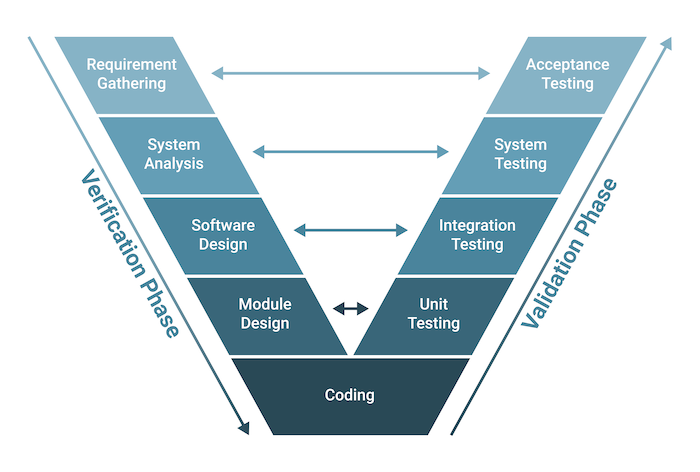

# Quest 15. 자동화된 테스트

## Introduction
이번 퀘스트에서는 자동화된 테스트에 어떤 장점이 있는지, 어떤 식으로 구축할 수 있는지에 대해 알아보겠습니다.

## Topics
* Automated Test
  * TDD
  * Unit Test
  * Integration Test
  * E2E Test
  * Stub & Mock
* Jest
* Puppeteer

## Resources
* [Unit Test (단위 테스트) 도입하기](https://www.popit.kr/unit-test-%EB%8B%A8%EC%9C%84-%ED%85%8C%EC%8A%A4%ED%8A%B8-%EB%8F%84%EC%9E%85%ED%95%98%EA%B8%B0-1%ED%8E%B8/)
* [소프트웨어 테스트 안티 패턴](https://velog.io/@leejh3224/%EC%86%8C%ED%94%84%ED%8A%B8%EC%9B%A8%EC%96%B4-%ED%85%8C%EC%8A%A4%ED%8A%B8-%EC%95%88%ED%8B%B0-%ED%8C%A8%ED%84%B4)
* [End-to-End testing with Puppeteer and Jest](https://medium.com/touch4it/end-to-end-testing-with-puppeteer-and-jest-ec8198145321)
* [Mock & Stub](https://stackoverflow.com/questions/3459287/whats-the-difference-between-a-mock-stub)

## Checklist
* ## 자동화된 테스트를 만드는 것에는 어떤 장점과 단점이 있을까요?
  최근 정보 기술의 지속적인 발전으로 수동 테스팅은 점차 자동화 테스팅으로 대체되고 있다. 자동화 테스팅 기술 덕분에 소프트웨어 테스팅 프로세스와 자동화 테스터의 업무가 효율적으로 수행된다.

  자동화된 테스팅은 특수한 자동화된 테스팅 소프트웨어 도구를 사용하여 테스트 케이스를 실행하는 소프트웨어 테스팅 방법이다. 자동화된 테스팅은 주로 다음과 같은 경우에 적용된다:
  * 많은 수의 테스트가 필요하며, 높은 빈도와 대량의 데이터를 짧은 시간 내에 수행해야 할 때.
  * 테스트가 여러 다른 환경에서 적용되어야 할 때.
  * 프로젝트가 안정적이며, 앞으로의 기능 변경이 없을 때.  

  자동화된 테스팅은 오늘날 가장 효과적인 소프트웨어 테스팅 방법이다. 자동화된 테스팅은 소프트웨어 테스트의 효율성, 테스트 범위 및 실행 속도를 향상시킨다.
  * 테스트 자동화는 워크플로우를 동기화하여 시간과 비용을 절약한다.
  * 자동화를 사용하면 다국어 웹사이트를 테스트할수 있다.
  * 테스트를 수행하는 동안 인간 개입이 필요하지 않다.
  * 자동화된 테스팅은 테스트의 속도와 범위를 증가시키는 데 도움을 준다.
  * 테스트 자동화는 모니터링 프로세스를 더 정확하고 명확하게 만들어준다.
  * 자동화 덕분에 프로세스를 반복할 수 있다.

  자동화된 테스팅은 자동화 테스터뿐만 아니라 기업에도 많은 이점을 제공한다.
  * 자동화된 테스팅 도구는 인간보다 안정적이므로 테스트 자동화의 신뢰성이 더 높다.
  * QA 처리 시간을 최대 80%까지 줄여 소프트웨어 출시 시간을 단축하는 데 도움을 준다.
  * 자동화된 테스팅은 비용을 절감하고 소프트웨어 정확성을 향상시키며 정보 일관성을 보장하는 데 도움을 준다.
  * 소프트웨어의 기능 업데이트나 인터페이스 변경이 있는 경우 테스트를 소프트웨어의 다른 버전에 재사용할 수 있다.

  하지만 여러 한계도 있다.
  * 노동 비용, QA 엔지니어 고용 및 특화된 자동화 소프트웨어 도구 비용이 높다.
  * 소프트웨어 테스트를 처음 설계하는 데 필요한 시간이 상당히 길며 테스트하기 전에 주의 깊게 설치되어야 한다.
  * 필요한 대로 테스트를 유지 및 업그레이드하는 데 많은 시간과 노력이 필요하다.
  * 테스터들은 경험이 있고 매우 전문적인 프로그래밍 기술을 가져야 한다.

  * ### TDD(Test-Driven Development)란 무엇인가요? TDD의 장점과 단점은 무엇일까요?
    소프트웨어는 유동적이고 예측하기 어렵다. 또한 소프트웨어가 발전하면서 점차 확장가능성, 개방적 구조를 요구하게 되었다. 따라서 구체적으로 개발이 언제 완료될 것인지 예측하는 것이 매우 어려울 뿐더러, 인원과 비용을 늘린다고 해서 개발 시간의 절감이나 질적인 성과를 보장할 수 없다. 

    전통적인 공학론적 개발 방식에서는 세운 계획대로 개발이 흘러가지 않으며, 그것을 보완하기 위해 언제나 개발이 지연되었고, 개발자에게 주어지는 스트레스와 과중한 업무, 그 결과 떨어지는 생산성과 상품성 등에 직면하게 된다. 이에 완전한 설계를 지향하는 폭포수 모델을 폐기하고, 초기의 설계 비용을 줄이고자 작은 규모의 소프트웨어를 완성한 다음 그것을 점차 보완해가며 복잡한 소프트웨어를 완성하는 애자일 프로그래밍(Agile programming) 방식을 도입하게 됐다. 그중 익스트림 프로그래밍(XP, Extreme Programming)과 테스트 주도 개발(TDD, Test-Driven Development)이 대표적이다.

    다른 애자일 방법론과 구별되는 XP의 특징은 테스팅이다. 구현과 테스트를 하나의 쌍으로 취급하여, 실제 구현과 동시에 테스트 코드를 작성하도록 하며, 이것에 기반한 프로젝트 발전 과정은 애자일 방법론의 기본 개념인 "반복적으로 프로토 타입을 고객에 전달함으로써 고객의 요구사항 변화에 민첩하게 대응한다"를 실천하는데에 큰 도움을 줄 수 있다.

    TDD는 XP 개발방법론의 실천 방안 중 하나이다. 개발이 이루어진 다음 그것이 계획대로 잘 완성되었는지 테스트 케이스를 작성하고 테스트하는 타 방식과는 달리, 테스트 케이스를 먼저 작성한 다음 테스트 케이스에 맞추어 실제 개발 단계로 이행하는 개발방법론을 말한다. 묵시적으로 잠재된 상황을 가정하지 않고 테스트 케이스만을 완벽하게 수행하는 것을 목표로 하기 때문에 매우 빠르게 목표를 완료할 수 있다. 
    
    __장점:__
    * <U>코드의 유지보수가 용이해진다</U>:    
    프로그래밍 개발에서는 처음 개발할 때보다 이미 개발한 코드의 버그를 수정하고, 최적화하고, 새 기능을 추가할 때 비용이 더 들어간다. 그런데 테스트를 작성하면 코드에 절대로 뒤떨어지지 않는 문서가 탄생하며, 다른 코드의 행위가 보증되므로 원하는 부분에만 신경을 쓸 수 있으며, 테스트하기 쉬운 코드는 자연히 품질이 높아지므로 다시 읽기도 편하다. 또한 테스트가 있으면 안심하고 코드를 리팩토링할 수 있다.

    * <U>프로그래밍 시간이 단축된다</U>:    
    프로그래밍에서 대부분의 시간이 디버깅에 투입되는데, 테스팅은 디버깅을 해야 할 범위를 단위 안으로 제한함으로써 디버깅에 들어가는 노고를 크게 줄여준다. 또한 유지보수 시에도 상술한 이유로 효율이 높아진다. 특히 JavaScript나 Python 등의 동적 타입 언어로 개발을 할 경우 TDD는 필수적이라고 할 수 있다.

    * <U>뛰어난 프로그램 소스코드 기록</U>:      
    테스트를 작성하는거 자체가 훌륭한 소스 코드의 기록이다. 소스 코드 중간중간의 주석은 왜 코드가 이렇게 짜여져 있는지를 기록한다면, 유닛 테스트는 코드가 어떻게 행동해야 하는지를 기록한다. 따라서 다른 프로그래머들이 쓴 (또는 과거의 자신이 쓴) 코드를 파악하고 프로그램을 수정, 확장하는데 시간과 비용이 크게 단축된다.

    __단점:__
    * <U>인간은 실수를 미리 인지하지 못한다</U>:      
    테스트를 미리 작성하고 코드를 작성한다는 것은 이미 해당 실수가 일어날수 있다고 인지하고 있는 상황에서나 적용 가능한 이야기다. 대표적으로 결과가 확정되어 있는 수학 라이브러리 코드 등이 이에 속한다. 하지만 이러한 수학문제가 아닌 대부분의 프로그래밍 사례에서는 미리 작성된 테스트가 개발자의 실수를 답습하기만 한다. 코드를 쓰고 문제가 발생 했을 때 테스트를 작성하나, 테스트를 작성하고 코드를 작성하고 문제를 발견하나 결국 발생할 실수는 똑같이 발생하기 때문에 프로그래밍 시간이 결코 단축되지는 않는다.

    * <U>변경되는 비즈니스 로직에 대응하지 못한다</U>:       
    과거의 소프트웨어는 한번 출하하면 대부분의 경우 비즈니스 로직이 크게 변화하지 않았다. 하지만 요즘 처럼 구독제, ESD(전자 소프트웨어 배급electronic software distribution, ESD) 형태의 판매 방식으로 인해 제품의 비즈니스 로직은 충분히 변경 가능한 스펙이 되었다. 그로 인해 TDD를 적용해 변경 사항에 대응한다면 코드 뿐만 아니라 테스트까지 대규모 유지보수 대상이 되기 때문에 막대한 개발 비용이 발생한다. 또한 기존 테스트를 유지하더라도, 점점 증가하는 코드 커버리지는 이후 개발비용에 꾸준히 부담을 주게 한다.

    * <U>추가적인 기록물의 증가</U>:       
    주석의 치명적인 단점은 주석이 항상 코드와 동일한 내용을 보장하지 못한다는 것이다. 쉽게 말하면 소스코드에 쓰여진 주석의 내용과 TDD용으로 개발된 테스트와 실제 라이브 서비스에서 돌아가는 코드와 개발문서가 다를수도 있다. 추가적인 기록물이 늘어나는 만큼 추후에 읽고 검증해야할 기록물 또한 늘어난다.

    [출처: 나무위키](https://namu.wiki/w/%ED%85%8C%EC%8A%A4%ED%8A%B8%20%EC%A3%BC%EB%8F%84%20%EA%B0%9C%EB%B0%9C)

* ## 테스트들 간의 계층에 따라 어떤 단계들이 있을까요?
  소프트웨어 개발 단계에 따른 테스트는 개발 단계의 순서와 짝을 이루어 테스트를 진행한다. 이 과정을 그래프로 그리면 영어 V와 모양이 비슷하다고 해서 V 모델이라고 부르기도 한다.

  
  [이미지 출처](https://synthesis.to/2021/03/15/control_flow_analysis.html)

  이 과정은 다음과 같이 수행된다.
  * <U>단위 테스트 (Unit Testing)</U>:     
    소프트웨어의 가장 작은 단위인 함수, 메소드, 혹은 클래스, 모듈 등의 개별 단위를 테스트한다. 주로 개발자에 의해 작성되며, 코드의 각 부분이 기대한 대로 작동하는지 확인한다. 상위나 하위 모듈이 필요한 경우가 있는데, 이 모듈들이 개발이 되지 않았을 경우 가상의 상위/하위 모듈을 만들어서 테스트한다. 이때 가상의 상위 모듈을 테스트 드라이버(test driver)라고 하고, 가상의 하위 모듈을 테스트 스텁(test stub)이라고 한다.
  
  * <U>통합 테스트 (Integration Testing)</U>:    
    단위 테스트된 개별 단위들을 함께 통합하여 시스템 전체의 동작을 테스트한다. 각 컴포넌트 간의 상호작용과 통합된 시스템의 동작을 확인한다. 통합을 한꺼번에 하냐, 점진적으로 하냐에 따라 나뉜다.
    >한꺼번에 통합하는 빅뱅 테스트: 모듈 통합을 한꺼번에 수행하는 경우에 빅뱅 테스트를 수행한다. 이 방법은 단위 테스트가 끝난 모듈을 모두 모아 한 번에 통합한 후 테스트를 한다. 주로 소규모 프로그램이나 프로그램 일부를 구현하는 과정에서 수행한다.

    >점진적 통합 - 하향식 기법: 하향식 기법은 모듈의 계층 구조에서 맨 위의 모듈부터 시작해 하위 모듈 방향으로 통합해나가는 방식. 이 방식은 프로그램 전체에 영향을 주는 오류를 일찍 발견할 수 있게 한다. 그러나 스텁이 불완전해 결과가 완전하지 않을 수도 있고, 스텁 자체를 만드는데도 시간이 오래 소요될 수 있다. 

    >점진적 통합 - 상향식 기법: 상향식 기법은 가장 아래의 모듈부터 테스트를 시작한다. 이 방식은 하위 모듈을 충분히 테스트할 수 있고 정밀 계산, 데이터 처리에 사용하면 좋다. 하지만 상위 모듈에 오류가 발생하면 그와 관련된 하위 모듈을 다시 테스트해야하는 번거로운점이 있다.

  * <U>시스템 테스트 (System Testing)</U>:      
    통합된 시스템 전체를 테스트하여 요구 사항과 사용자의 기대에 부합하는지 확인한다. 시스템의 기능적 및 비기능적 요구 사항을 평가하고, 성능, 보안, 안정성 등을 검증한다. 사용자 시나리오를 기반으로 테스트 케이스를 작성하고, 실제 환경에서 시스템을 테스트한다. 이 과정은 소프트웨어를 사용자에게 전달하기 전에 개발자가 진행하는 마지막 테스트이다.
  
  * <U>인수 테스트 (Acceptance Testing)</U>:     
    최종 사용자나 고객이 시스템의 완전한 기능 및 사용 가능성을 확인하기 위해 수행하는 테스트. 비즈니스 요구 사항을 충족하는지 여부를 평가하고, 사용자가 예상대로 시스템을 사용할 수 있는지 확인한다. 사용자 인터페이스(UI), 사용자 편의성, 시스템의 전반적인 용이성 등을 평가한다. 만약, 발주가 아닌 출시가 목적인 소프트웨어는 알파 테스트와 베타 테스트를 수행한다.
    >알파 테스트: 내부 필드 테스트라고 하며, 개발 완료된 소프트웨어를 내부에서 테스트하며 오류와 사용 문제점을 파악한다.

    >베타 테스트: 알파 테스트를 완료한 소프트웨어를 시장에 내놓기 전에 실제 시장의 피드백을 얻기 위해 수행하는 테스트이다. 일부 사용자들에게 미리 소프트웨어를 배포해 사용자 입장에서 발생하는 피드백들을 받는다.

  * <U>회귀 테스트 (Regression Testing)</U>:     
    소프트웨어 변경이나 업데이트 후에 이전에 동작하던 기능이 여전히 정상적으로 작동하는지 확인하기 위한 테스트. 새로운 기능 추가, 버그 수정 등의 변경으로 인해 이전에 동작하던 기능에 영향을 미치는지 여부를 검증한다. 

  * ### 유닛 테스트, 통합 테스트, E2E 테스트는 각각 어떤 것을 뜻하나요?
    <U>E2E 테스트 (End-to-End Test)</U>는 시스템 테스트의 한 유형으로서, 시스템의 전체적인 기능과 흐름을 테스트하는 것으로, 사용자의 시각에서 시스템을 테스트한다. 시스템의 각 구성 요소와 외부 시스템 간의 상호작용을 검증하고, 사용자 시나리오를 기반으로 테스트 케이스를 작성한다. 실제 환경에서 시스템을 실행하고, 사용자 인터페이스(UI)를 포함하여 모든 구성 요소가 예상대로 작동하는지 확인한다.

  * ### 테스트에 있어서 Stub과 Mock은 어떤 개념을 가리키는 것일까요?
    `Stub`은 테스트 중인 코드가 의존하는 외부 리소스나 모듈의 대역을 대신하는 가상 객체이다. 주로 단위 테스트에서 사용되며, 테스트 중인 코드가 다른 컴포넌트와 상호작용할 때 실제 구현 대신 사용된다. `Stub`은 테스트의 일관성을 유지하고 외부 의존성을 격리하여 테스트를 더 쉽게 해준다. 예를 들어, 네트워크 호출이 있는 함수를 테스트할 때 네트워크 호출을 대신하여 항상 동일한 응답을 반환하는 `Stub`을 사용할 수 있다.

    `Mock`은 테스트 중인 코드가 다른 컴포넌트와 상호작용할 때, 그 상호작용을 시뮬레이션하는 객체이다. 특정한 호출이 발생하였을 때 어떤 동작이 이루어져야 하는지를 명세하고, 실제로 호출되었는지 여부를 추적할 수 있다. 주로 단위 테스트나 통합 테스트에서 사용되며, 외부 리소스나 모듈의 상호작용을 테스트하는 데 유용하다. 예를 들어, 특정 메소드가 호출되었을 때 그 호출이 발생했는지를 확인하거나, 특정 매개변수로 메소드가 호출되었을 때 어떤 동작을 해야 하는지를 정의할 때 `Mock`을 사용할 수 있다.

    간단히 말해, `Stub`은 외부 의존성을 대체하는 가짜 객체이고, `Mock`은 테스트 중인 코드의 상호작용을 시뮬레이션하고 추적하는 객체이다. 이 두 가지 개념은 테스트 중인 코드와 외부 의존성을 격리하여 테스트를 더 쉽게 만들어주는데 도움이 된다.

* ## Jest는 어떤 일을 하며 어떻게 사용하는 테스트 프레임워크일까요?
  `Jest`는 자바스크립트용 단위 테스트 프레임워크. Facebook에서 만들었다. 주로 React, Vue, Angular 등의 프론트엔드 프레임워크 및 Node.js 기반의 백엔드 개발에서 널리 사용되고 있다. 출시 초기에는 프론트앤드에서 주로 쓰였지만 최근에는 백앤드에서도 기존의 자바스크립트 테스팅 라이브러리를 대체하고 있다.

  `Jest` 이전에는 자바스크립트 코드를 테스트하라면 여러가지 테스팅 라이브러리를 조합해서 사용하곤 했었다. 이런 라이브러리들은 굉장히 유사하지만 살짝씩 다른 API를 가지고 있었기 때문에, 여러 프로젝트에 걸쳐서 일하는 자바스크립트 개발자들에게 혼란을 주기도 했었다. 하지만 `Jest`는 라이브러리 하나만 설치하면, 여러가지 기능을 하는 프레임워크까지 제공해주기 때문에 현재 대세라고 말할 수 있다.

  사용 방법:
  1. 설치: 프로젝트에 `Jest`를 설치.
  ```
  npm install --save-dev jest
  ```

  2. 테스트 작성: *.test.js, *.spec.js와 같은 파일을 만들어 테스트 케이스를 작성.
  ```js
  import add from './add.js'

  test('1 plus 1 equals 2', () => {
    const sum = add(1,1);
    expect(sum).toBe(2);
  })

  test('5 plus 5 is not equal to 9', () => {
    const sum = add(5,5);
    expect(sum).not.toBe(9);
  })
  ```
  3. 실행: `Jest` 명령어를 실행하여 테스트를 수행.
  ```
  npx jest
  ```
  4. 설정: 필요에 따라 Jest의 환경을 설정하고 커스터마이징 한다. `jest.config.js` 파일을 통해 설정할 수 있다.
  ```json
  {
    "preset": "jest-puppeteer"
  }
  ```
  5. 모킹과 스파이 기능 사용: jest.mock() 함수나 jest.spyOn() 함수를 사용하여 모킹과 스파이 기능을 활용.
  6. 스냅샷 테스트: 변경 가능한 결과에 대한 스냅샷을 생성하고 검증하는 스냅샷 테스트를 작성.
     >스냅샷 테스팅(snapshot testing)이란 어떤 기능의 예상 결과를 미리 정확히 포착해두고 실제 결과에 비교하는 테스트 기법.

  [JEST](https://jestjs.io/)

  * ### Jest 이외의 테스트 프레임워크는 어떤 것이 있고 어떤 장단점이 있을까요?
    Top JavaScript Testing Frameworks:      

    <U>MochaJS</U>
    * 유연하고 확장 가능한 테스트 프레임워크.
    * 다양한 어설션(assertion) 라이브러리(예: Chai)와 함께 사용할 수 있다.
    * 비동기 코드에 대한 테스트를 지원하며, Promise 및 콜백 스타일의 테스트를 작성할 수 있다.
    * 설정이 Jest보다 복잡할 수 있다.
    * Mocha 자체에는 mocking 기능이 내장되어 있지 않으므로, mocking에 대한 별도의 라이브러리를 사용해야 한다.

    <U>Jest</U>

    <U>Jasmine</U>
    * BDD(Behavior Driven Development) 스타일의 테스트를 작성할 수 있다.
    * 스파이(Spy), 모의(Mock), 스텁(Stub)과 같은 mocking 기능이 내장되어 있다.
    * Jest와 마찬가지로 쉽게 시작할 수 있는 사용자 친화적인 문법을 제공.
    * Jest나 Mocha에 비해 실행 속도가 느릴 수 있다.
    * Jasmine은 통합된 assertion 라이브러리를 제공하므로, 다른 어설션 라이브러리와 함께 사용하기 어렵다.

    <U>Karma</U>
    * 다양한 브라우저에서 테스트를 실행할 수 있으며, 여러 브라우저에서 동시에 테스트를 병렬로 실행할 수 있다.
    * 파일이 변경될 때마다 테스트를 자동으로 다시 실행하고 결과를 실시간으로 업데이트하여 개발자가 빠르게 피드백을 받을 수 있도록 지원.
    * 다양한 플러그인을 통해 테스트 환경을 확장할 수 있으며, 웹팩(Webpack), 자동화 도구 등과 연동하여 프로젝트에 맞게 사용할 수 있다.
    * Mocha, Jasmine, QUnit 등 다양한 테스트 프레임워크와 함께 사용할 수 있으며, 설정을 통해 프로젝트에 적합한 테스트 프레임워크를 선택할 수 있다.
    * 초기 설정이 다소 복잡할 수 있다.
    * 브라우저가 많은 경우에는 테스트 실행 속도가 느려질 수 있다.
    * 웹팩과 함께 사용할 때 Karma의 설정이 복잡해질 수 있다.

    <U>Puppeteer (Node Library)</U>

    <U>NightwatchJS</U>

    <U>Cypress</U>

    <U>Playwright (Node Library)</U>

    [BrowserStack](https://www.browserstack.com/guide/top-javascript-testing-frameworks)

* ## Puppeteer는 어떤 일을 하며 어떻게 사용하는 테스트 프레임워크일까요?
  `Puppeteer`는 Google에서 개발한 Node.js 라이브러리로, 브라우저 자동화를 위한 도구이다. 주로 웹 스크래핑, 웹 테스팅, 사용자 인터페이스(UI) 테스트, 웹 사이트 자동화 등 다양한 목적으로 사용된다. `Puppeteer`는 Chrome 브라우저의 headless 모드(창 없는 모드)를 제어하여 웹 페이지의 동작을 시뮬레이션하고 테스트할 수 있다.

  Puppeteer를 사용하여 다음과 같은 작업을 수행할 수 있다.
  * 웹 스크래핑: `Puppeteer`를 사용하여 웹 페이지의 내용을 가져오고 분석할 수 있다. 이를 통해 웹 페이지의 데이터를 수집하거나 정보를 추출할 수 있다.
  * 웹 테스트: `Puppeteer`를 사용하여 웹 페이지의 동작을 자동으로 테스트할 수 있다. 사용자의 행동을 시뮬레이션하고 웹 페이지의 상태를 검증하여 웹 애플리케이션의 품질을 확인할 수 있다.
  * 사용자 인터페이스(UI) 테스트: `Puppeteer`를 사용하여 사용자가 웹 페이지와 상호작용하는 것과 같은 시나리오를 테스트할 수 있다. 버튼 클릭, 입력, 폼 제출 등의 작업을 자동으로 수행하고 결과를 검증할 수 있다.
  * 웹 사이트 자동화: `Puppeteer`를 사용하여 웹 페이지의 작업을 자동화할 수 있다. 예를 들어, 웹 페이지에서 정보를 입력하고 제출하는 작업을 자동화할 수 있다.

  사용 방법:
  1. 설치:
  ```
  npm install puppeteer
  ```
  2. 예시:
  ```js
  import puppeteer from 'puppeteer';

  describe('Login Test', () => { // 하나 이상의 관련된 테스트들을 그룹화
    let browser;
    let page;

    beforeAll(async () => { // 첫 번째 테스트가 실행되기 전에 실행되는 함수
      browser = await puppeteer.launch();
      await browser.newPage();
    });

    afterAll(async () => {
      await browser.close();
    });

    it('Rendering domain page', async () => { // 단일 테스트를 정의하는 함수, test랑 같다
      await page.goto('https://localhost:3000');

      const title = await page.title();
      expect(title).toBe('NotePad');
      });
  });
  ```

  `Puppeteer`는 주로 E2E 테스트에서 활용되며, 사용자의 시점에서 웹 애플리케이션의 동작을 테스트할 수 있도록 도와준다. 또한, 웹 스크래핑이나 자동화 작업에서도 유용하게 사용될 수 있다.

## Quest
* 직전 퀘스트의 메모장의 서버와 클라이언트 각 부분에 유닛 테스트, 통합 테스트, E2E 테스트 등을 추가해 보세요.
  * `npm test` 명령을 통해 모든 테스트가 돌고 그 결과를 출력할 수 있어야 합니다.
