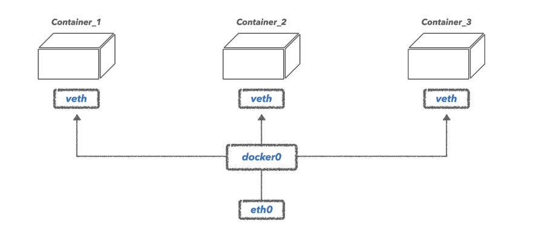

# Quest 16-B. 컨테이너

## Checklist
* ### 컨테이너는 어떻게 동작하나요? 다른 배포판을 사용할 수 있게 하는 원리가 무엇일까요?
  컨테이너는 크게 시스템 컨테이너와 애플리케이션 컨테이너로 나뉩니다.

  **시스템 컨테이너 system container**   
  시스템 컨테이너는 컨테이너 기술들을 사용해 운영체제 위에 하드웨어 가상화 없이 운영체제를 실행합니다. 일반적인 리눅스처럼 init 프로세스 등을 사용해서 다수의 프로세스가 같은 환경을 공유하는 것을 목표로 합니다. 시스템 컨테이너를 지향하는 컨테이너 런타임으로는 대표적으로 LXC와 LXD가 있습니다.

  **애플리케이션 컨테이너 application container**     
  애플리케이션 컨테이너는 컨테이너 기술을 활용해 하나의 애플리케이션(프로세스)를 실행하는 것을 목표로 합니다. 독립적인 환경을 가진다는 점에서는 시스템 컨테이너와 동일하지만, 단 하나의 프로세스만 실행한다는 점에서 확장이 쉽고 관리 요소가 거의 없습니다. 대표적인 애플리케이션 컨테이너 런타임으로는 도커Docker가 있습니다.

  ### 동작 원리

  * #### The Kernel and the OS
    컴퓨터, 노트북은 CPU, 보조(장기) 기억 장치(디스크 드라이브, SSD), 메모리, 네트워크 카드 등과 같은 하드웨어를 기반으로 만들어져 있습니다. 
  
    이러한 하드웨어와 상호작용하기 위해서, 커널(kernel)이라 불리는 운영체제 내의 작은 부분이 하드웨어와 커널을 제외한 나머지 시스템 간의 다리 역할을 수행하고 있습니다. 커널은 실행될 프로세스(프로그램)의 스케쥴링을 담당하며, 장치들을 관리하고(디스크나 메모리의 특정 주소를 읽거나 쓰고), 이외에 더 많은 것을 합니다.

    운영체제의 나머지 부분은 부팅을 담당하며, 유저 프로세스가 실행되는 유저 공간(user space)를 관리하고 끊임없이 커널과 상호작용합니다.

    
    [이미지 출처](https://goofcode.github.io/container-101)

  * #### The Virtual Machine
    MacOS 컴퓨터와 Ubuntu에서 실행되도록 만들어진 응용프로그램이 있다구요? 널리 사용되는 해결 방법은 MacOS에서 Ubuntu 가상머신을 부팅시켜 거기서 프로그램을 실행시키는 것입니다.

    가상머신은 게스트 운영체제를 실행하는 몇 단계의 하드웨어와 커널 가상화로 이루어져 있습니다. 하이퍼바이저(hypervisor)라고 불리는 소프트웨어 조각이 가상 디스크, 가상 네트워크 인터페이스, 가상 CPU 등을 포함하는 가상화된 하드웨어를 생성합니다. 가상머신에는 이 가상 하드웨어와 소통하는 게스트 커널 또한 포함되어 있습니다.

    하이퍼바이저는 hosted 될 수 있는데, 이는 예시로 든 것 처럼 하이퍼바이저가 호스트 OS (MacOS) 위에서 동작하는 소프트웨어라는 것을 의미합니다. 하이퍼바이저는 또한 bare metal이 될 수 있는데, 머신 하드웨어 위에서 직접적으로 동작하는 (기존 OS를 대체하는) 것입니다. 어떤 방식이든, 하이퍼바이저를 사용한 접근법은 다수의 파트에 대한 가상화를 필요로 하기 때문에 무겁다고 여겨집니다.

    같은 머신에 다수의 독립적인 그룹을 구성할 필요성이 있을 때, 각각의 그룹에 대해 가상머신을 작동시키는 것은 좋은 접근법이라기엔 너무 무겁고 리소스를 낭비하게 됩니다.

    
    [이미지 출처](https://goofcode.github.io/container-101)

    가상머신은 머신 수준의 분리를 위해 하드웨어 가상화가 필요한 반면 컨테이너는 동일한 운영체제 내의 독립된 공간에서 실행됩니다. 독립된 공간의 수가 증가할 수로 오버헤드의 차이가 더 명확해집니다. 일반적인 노트북으로 수십개의 컨테이너를 실행시킬 수 있지만 단 하나의 가상머신도 버거울 수 있습니다.

  * #### cgroups
    2006년, 구글의 엔지니어들은 Linux “control groups”라는 것을 발명하였고 이를 줄여 cgroups이라 합니다. cgroups는 유저 프로세스의 리소스 사용을 분리하여 관리하는 Linux 커널의 기능입니다.

    이러한 프로세스들을 같은 리소스 제한을 공유하는 프로세스의 집합인 네임스페이스(namespace)에 집어 넣을 수 있습니다. 하나의 컴퓨터는 다수의 네임스페이스를 가질 수 있고, 각각은 커널에 의해 강제된 리소스 속성(제한)을 갖습니다.

    네임스페이스 별 리소스 할당은 해당 프로세스 집합이 사용할 수 있는 전반적인 CPU, RAM 등의 리소스 양을 제한합니다. 예로, 백그라운드 log aggregation 어플리케이션이 우발적으로 서버를 망가뜨리지 않도록 리소스 제한을 둘 수 있습니다. 

    원래의 기능은 아니지만, Linux의 cgroups는 다시 만들어져 네임스페이스 분리(namespace isolation)이라는 기능을 포함하게 되었습니다. 네임스페이스 분리 자체는 새로운 아이디어가 아니고, Linux는 이미 많은 종류의 네임스페이스 분리를 가지고 있었습니다. 흔히 사용되는 예시가 프로세스 분리(process isolation)인데 각 개별적인 프로세스를 분리하고 공유 메모리와 같은 일들을 방지합니다.

    cgroup 분리는 더 높은 수준의 분리인데, 이는 같은 cgroup 네임스페이스 내의 프로세스들이 다른 네임스페이스의 프로세스들로부터 독립적이도록 보장해주는 것입니다. 몇가지 중요한 네임스페이스 분리 기능들을 아래에 요약하였습니다.

    * PID(프로세스 ID) 네임스페이스: 이는 한 네임스페이스 내의 프로세스가 다른 네임스페이스의 프로세스의 존재를 알지 못하도록 해줍니다.
    * 네트워크 네임스페이스: 네트워크 인터페이스 컨트롤러, iptable, 라우팅 테이블과 더 low한 level의 네트워킹 툴의 분리를 제공합니다.
    * 마운트 네임스페이스: 파일 시스템이 마운트되어 네임스페이의 파일 시스템 범위를 마운트된 디렉토리로 제한시킵니다.
    * 유저 네임스페이스: 네임스페이스 내 유저를 해당 네임스페이스만으로 제한시켜 네임스페이스에 걸쳐 유저 ID가 충돌하는 것을 방지합니다.

    간단히 말해, 네임스페이스 내부의 프로세스에게 각 네임스페이스는 고유한 머신으로 보입니다.

  * #### Linux Containers
    Linux cgroups는 LXC (linux container)라는 기술의 기반이 되었습니다. LXC는 오늘날 컨테이너라고 불리는 것의 가장 첫 번째 구현이었고, cgroups와 네임스페이스 분리를 사용하여 별개의 프로세스와 네트워킹 스페이스를 가진 가상 환경을 만들어냈습니다.

    LXC는 독립적이고 격리된 유저 스페이스를 어느 정도 가능하게 했습니다. 컨테이너의 개념은 LXC에 뒤따라 나왔습니다. 사실, 초기의 Docker는 LXC을 직접적인 기반으로 하여 만들어졌습니다.

  * #### Docker
    Docker는 가장 널리 사용되는 컨테이너 기술이고, 사람들이 컨테이너라고 하면 대부분 Docker를 가르키는 것입니다. 다른 오픈소스 컨테이너 기술들(CoreOS의 rkt 등)과 직접 컨테이너 엔진을 만드는 거대 기업들(Google의 lmctfy 등)도 있지만, Docker는 컨테이너화(containerization)의 산업 표준이 되었습니다. Docker는 여전히 cgroups와 Linux 커널, 최근 Windows에서 제공되는 네임스페이스 기술을 기반으로 하고 있습니다.

    Docker 컨테이너는 여러 image(이미지, 하나의 패키지로 묶인 바이너리)들의 레이어로 이루어져 있습니다.base image는 컨테이너의 운영체제를 포함하고 있고, 이 OS는 호스트의 OS와 다를 수 있습니다.

    컨테이너의 OS는 이미지의 형태로 되어 있습니다. 이는 호스트 OS와 다르게 완전한 운영체제가 아닙니다. 완전한 운영체제는 파일시스템, 바이너리, 커널을 포함하는 반면 이 이미지는 파일 시스템과 바이너리만을 포함합니다.

    이 base image 위에 각각이 컨테이너의 부분이 되는 다수의 이미지들이 올라갑니다. 예를 들어, apt-get 의존성을 포함하는 이미지가 base image 위에 올라갈 수 있습니다. 그 위에는 어플리케이션 바이너리 등을 포함하는 이미지가 올라갈 수 있습니다.

    멋진 사실은 만약 두 컨테이너가 각각 레이어 a, b, c와 레이어 a, b, d로 되어 있다면 각 레이어 a, b, c, d의 하나의 복사본만을 local과 repository에 보관하면 됩니다. 이것이 바로 Docker의 유니온 파일 시스템(union file system)입니다.

    
    [이미지 출처](https://goofcode.github.io/container-101)

    해시로 식별되는 각 이미지는 컨테이너를 구성하는 많은 가용 레이어 이미지들 중 하나입니다. 하지만 컨테이어너는 최상위 이미지로 식별되며, 부모 이미지에 대한 참조를 가집니다. 위 그림에서 두 최상위 이미지(image 1과 image 2)는 첫 3개의 레이어를 공유하고 있습니다. image 2는 구성과 관련된 2개의 레이어를 부가 적으로 가지지만, image 1과 같은 부모 이미지를 공유하고 있습니다.

    컨테이너가 부팅되면, 해당 이미지와 부모 이미지들이 저장소로부터 다운로드되고, cgroups과 네임스페이스가 만들어지며, 이미지를 사용하여 가상 환경을 생성합니다. 컨테이너 내에서는, 이미지에 명시된 파일과 바이너리들은 전체 머신에서의 유일한 파일들로 나타내어 집니다. 이후 컨테이너의 메인 프로세스가 실행되고 컨테이너는 alive 상태가 됩니다.

    Docker는 copy on write, volume(컨테이너 사이에서 공유되는 파일 시스템), docker daemon(머신의 컨테이너들을 관리), 버전 관리 저장소(컨테이너를 위한 Github) 등의 정말 멋진 기능들을 가지고 있습니다.

    
    [이미지 출처](https://goofcode.github.io/container-101)

    <command line 클라이언트(1) 은 도커 데몬(2)이라고 불리는 프로세스에 무엇을 해야할지 알려줍니다. 이 데몬은 registry 또는 repository로부터 이미지를 가져옵니다(3). 이러한 이미지들은 로컬 머신에 캐시되고(4) 데몬에 의해서 부팅되어 컨테이너를 실행합니다(5).>

  * #### Why Containers
    프로세스 분리 이외에, 컨테이너는 다른 많은 이점이 있습니다.

    컨테이너는 스스로 독립된 유닛으로서 해당 컨테이너를 지원하는 어느 곳에서든 실행될 수 있습니다. 그리고 각 인스턴스에서, 컨테이너는 완전히 동일합니다. 호스트 OS가 CentOS이던 Ubuntu이던 MacOS이건 심지어 Windows와 같은 UNIX 기반 OS인지 상관없습니다. 컨테이너 내에서 OS는 컨테이너가 지정한 OS가 됩니다. 그러므로 당신의 노트북에서 만든 컨테이너가 회사 서버에서 작동한다는 것을 확신할 수 있습니다.

    또한 컨테이너는 표준화된 작업 또는 연산의 유닛의 역할을 합니다. 흔한 패러다임이 바로 각 컨테이너가 하나의 웹서버, 하나의 데이터베이스 샤드(shard) 또는 하나의 Spark worker 등을 실행하게 하는 것입니다. 그러면 어플리케이션의 규모를 키우기(scale) 위해서는, 단순히 컨테이너의 수를 늘리기만 하면 됩니다.

    이러한 패러다임에서는, 각 컨테이너에게는 일정한 리소스 설정(CPU, RAM, 스레드의 수 등)이 주어지고, 어플리케이션의 규모를 증가시키기 위해서는 개별적인 컨테이너의 리소스 설정을 변경하는 대신 단지 컨테이너의 수를 증가시키면 됩니다. 이는 엔지니어가 어플리케이션의 규모를 증가시키거나 축소시켜야 할 때, 훨씬 쉬운 추상화를 제공해줍니다.

    컨테이너들을 마이크로 서비스 아키텍처를 구현하기 위한 훌륭한 도구로 사용할 수 있습니다. 이때 각 마이크로 서비스는 같이 동작하는 컨테이너 조합될 수 있겠죠. 예를 들어 Redis 마이크로 서비스는 하나의 마스터 컨테이너와 다수의 슬레이브 컨테이너를 사용하여 구현할 수 있습니다.

    이러한 (마이크로) 서비스 지향적 아키텍처는 엔지니어링 팀이 어플리케이션을 개발하고 배포하는 것을 쉽게 해주는 많은 중요한 성질들을 가지고 있습니다.

    >namespace: 
    > - 프로세스를 독립시켜주는 가상화 기술이다. 각 컨테이너에서 실행된 프로세스가 시스템(user, 파일, 네트워크, 호스트명, 프로세스)등에 대해 독립할 수 있게 해준다. 
    > - 프로세스 별로 리소스 사용을 분리한다.
    > - VM에서는 각 게스트 별로 독립적인 공간을 제공하고 충돌하지 않도록 Hardware Resource 자체를 가상화한다. 하지만 namespace의 경우, Hardware Resource 자체를 가상화하는 것이 아니라, Linux 내의 자원을 가상화한다.
    > - pid name spaces: 프로세스 격리 처리 (독립된 프로세스 공간 할당)
    > - net name spaces: 네트워크 인터페이스 
    > - ipc name spaces: IPC 자원에 대한 엑세스 관리
    > - mnt name spaces: 파일 시스템 포인트 관리
    > - uts name spaces: host name 할당

    >cgroup:
    > - Control Groups의 약자로 프로세스들이 사용할 수 있는 컴퓨팅 자원들을 제한하고 격리시킬 수 있는 리눅스 커널의 기능이다. namespace와 더불어 도커 컨테이너에서 완벽한 격리 환경을 만드는 데에 쓰이는 중요한 기능이다.
    > - cgroup를 이용하면 다음 자원들을 제한할 수 있다
    >   - 메모리
    >   - CPU
    >   - Network
    >   - Device
    >   - I/O

  ### 다른 배포판을 사용할 수 있게 하는 원리가 무엇일까요?
  컨테이너 기술이 다양한 배포판을 사용할 수 있게 하는 원리는 주로 격리와 이식성에 기반합니다. 이를 위해 컨테이너 기술은 다음과 같은 원리를 적용합니다:

  * 격리 (Isolation): 컨테이너는 호스트 시스템과 격리된 환경에서 실행됩니다. 이러한 격리는 컨테이너 내에서 소프트웨어와 의존성을 포함하여 모든 필요한 라이브러리, 바이너리 및 설정을 패키징할 수 있음을 의미합니다. 따라서 컨테이너는 호스트 시스템에 관계없이 독립적으로 실행될 수 있으며, 특정 배포판에 의존하지 않습니다.

  * 이식성 (Portability): 컨테이너 이미지는 소프트웨어와 그 의존성을 포함하는 패키지입니다. 따라서 컨테이너 이미지는 여러 환경에서 실행될 수 있으며, 배포판에 관계없이 일관된 방식으로 동작합니다. 또한 컨테이너 이미지는 Docker 및 OCI(Open Container Initiative)와 같은 표준을 준수하여 이식성을 보장합니다.

  * 가볍고 빠른 시작 (Lightweight and Fast Startup): 컨테이너는 호스트 시스템의 커널을 공유하므로 가볍고 빠르게 시작될 수 있습니다. 이러한 특성은 컨테이너를 다양한 환경에서 빠르게 배포하고 확장할 수 있게 합니다.

  따라서 컨테이너 기술을 사용하면 소프트웨어가 다양한 배포판과 환경에서 실행될 수 있으며, 이를 통해 개발자는 소프트웨어의 이식성을 향상시키고 운영 환경에서의 호환성을 보장할 수 있습니다.

  한 컴퓨터에서 A라는 도커 컨테이너를 두 개 배포했다면, 이 둘을 어떻게 구분할까요? 도커에서는 내부 규칙에 따라 해시 값(=컨테이너 id)과 임의의 이름(=컨테이너 이름)을 붙입니다. 물론 IP도 다르고요. 도커에서는 이렇게 바뀌어야 할 부분을 환경변수에 넣고 관리하도록 권합니다. 이러한 도커 이미지의 특징은, 소프트웨어 분야의 클래스와 public 변수, private 변수에 비견할 수 있습니다.

  

* ### 호스트와 컨테이너를 위한 네트워크를 어떻게 구성하나요?
  컨테이너가 실행될 때, 특정 내부 IP가 할당됩니다. 이때 내부 IP만으로는 외부와의 통신이 불가능하죠. 우리가 컨테이너를 활용하다 보면, 컨테이너와 컨테이너, 컨테이너와 호스트 등 서로 통신이 가능해야 할 순간이 필수일 겁니다. 이를 위해, 도커의 네트워크 구조를 살펴보고, 이러한 구조 아래에서 다양한 네트워크를 구성해 보겠습니다.

  ### 도커 네트워크의 구조
  도커의 기본적인 네트워크 구조는 아래와 같습니다.

  
  [이미지 출처](https://rimo.tistory.com/entry/Docker-Network-%ED%98%B8%EC%8A%A4%ED%8A%B8%EC%99%80-%EC%BB%A8%ED%85%8C%EC%9D%B4%EB%84%88%EB%A5%BC-%EC%9C%84%ED%95%9C-%EB%84%A4%ED%8A%B8%EC%9B%8C%ED%81%AC%EB%A5%BC-%EA%B5%AC%EC%84%B1%ED%95%B4%EB%B3%B4%EC%9E%90)

  우리가 확인해 봐야 할 요소는 크게 호스트의 `eth0`, 기본 브리지인 `docker0`, 컨테이너의 가상 네트워크 인터페이스인 `veth` 이 3가지입니다.

  * `eth0`: 호스트의 `eth0`은, 실제 우리가 외부와 연결할 때 사용하는 IP가 할당된 호스트 네트워크 인터페이스입니다.
  * `docker0`: `docker0`은 도커가 설치될 때, 기본적으로 구성되는 브리지입니다. 이 브리지의 역할은 호스트의 네트워크인 `eth0`과 컨테이너의 네트워크와 연결을 해주는 역할을 합니다. 하나의 브리지 안에서 다양한 컨테이너와 연결을 해줄 수 있으며, 새로운 브리지를 생성하는 것도 가능합니다. 가지가 뻗어져 나뭇잎과 연결되는 모습을 연상하면 편합니다.
  * `veth`: `veth`는 컨테이너의 내부 IP를 외부와 연결해 주는 역할을 하는 가상 인터페이스입니다.(virtual eth의 약자입니다.) 컨테이너가 생성될 때 `veth`가 동시에 생성되며, 이 `veth`를 호스트의 `eth0`과 연결시킴으로써 외부와의 통신이 가능해집니다. 그리고 이 연결을 `docker0`과 같은 브리지가 수행하게 되죠.

  이러한 네트워크 구조 아래, 도커 자체에서 제공하는 네트워크 드라이버인 Bridge 네트워크, Host 네트워크, None 네트워크, Container 네트워크 등이 있습니다. 도커의 network명령을 통해 생성되어 있는 기본 네트워크 드라이버들을 확인할 수 있습니다. 이때 bridge가 위에서 말한 `docker0`이라고 보면 되겠습니다.

  ```shell
  $ docker network ls
 
  NETWORK ID     NAME          DRIVER    SCOPE
  357d25bdb2dc   bridge        bridge    local
  394e57d3ebab   host          host      local
  085ab69423f0   none          null      local
  ```

  ### 브리지(Bridge) 네트워크
  #### 기본 브리지
  우선 기본적으로 생성되어 있는 `docker0` 브리지를 살펴보겠습니다. docker의 inspect명령을 통해 상세 정보를 불러올 수 있습니다.

  ```shell
  $ docker inspect bridge
 
  "Scope": "local",
  "Driver": "bridge",
  "EnableIPv6": false,
  "IPAM": {
        "Driver": "default",
        "Options": null,
        "Config": [
            {
                "Subnet": "172.17.0.0/16",
                "Gateway": "172.17.0.1"
            }
      ]
  ```

  출력에서 IP 세부 정보를 살펴보면, 172.17.x.x 대역대의 내부 IP를 사용하고 있음을 볼 수 있습니다. 해당 브리지와 연결되는 컨테이너는 172.17.x.x 대역대의 IP를 순차적을 부여받게 될 것입니다. 확인해 보겠습니다.

  ```shell
  docker run -it --name ubuntu1 ubuntu
  ```

  특정 브리지를 연결시켜주지 않으면, 기본적으로 docker0 브리지에 연결됩니다. 컨테이너 내부에서 ifconfig 명령어를 통해 현재 할당받은 ip를 확인해 봅니다. 이때, ubuntu에선 특정 버전 이후 ifconfig가 없을 수 있으니, `apt update` `apt install net-tools`를 통해 설치해 주도록 합니다.

  ```shell
  $ ifconfig
 
  eth0: flags=4163<UP,BROADCAST,RUNNING,MULTICAST>  mtu 1500
          inet 172.17.0.2  netmask 255.255.0.0  broadcast 172.17.255.255
          ether 02:42:ac:11:00:02  txqueuelen 0  (Ethernet)
          RX packets 2323  bytes 24816714 (24.8 MB)
          RX errors 0  dropped 0  overruns 0  frame 0
          TX packets 1975  bytes 136621 (136.6 KB)
          TX errors 0  dropped 0 overruns 0  carrier 0  collisions 0  
  ```

  해당 컨테이너는 현재 172.17.0.2 ip를 할당받았습니다. 브리지와 동일한 대역대(172.17.x.x)를 사용함을 볼 수 있고, 추가로 컨테이너를 하나 더 실행하고 확인해 보면, 172.17.0.3를 할당받은 걸 확인할 수 있을 것입니다. 브리지 대역대를 순차적으로 할당해 주기 때문이죠.

  #### 새로운 브리지 생성
  이제는 기본 bridge가 아닌, 새로운 나만의 브리지를 생성해 보겠습니다. 도커의 `network` 명령어로 쉽게 생성할 수 있습니다.

  ```shell
  docker network create --driver bridge new_bridge
  ```

  해당 브리지의 대역대를 살펴보겠습니다.

  ```shell
  $ docker inspect new_bridge
 
  [
      {
          "Name": "new_bridge",
          "Id": "b31f9d8ae3cf7ada52782459b450be180ebfef546685648a43b8d4cd958e4ed6",
          "Created": "2023-04-14T02:31:41.089862423Z",
          "Scope": "local",
          "Driver": "bridge",
          "EnableIPv6": false,
          "IPAM": {
              "Driver": "default",
              "Options": {},
              "Config": [
                  {
                      "Subnet": "172.20.0.0/16",
                      "Gateway": "172.20.0.1"
                  }
              ]
          },
  ```

  앞서 살펴봤던 기본 브리지와는 달리, 172.20.x.x 대역대를 사용하고 있음을 볼 수 있습니다. 새롭게 생성한 브리지와 연결되는 컨테이너를 새로 생성해 보겠습니다. `--net`옵션을 사용하여 손쉽게 연결할 수 있습니다.

  ```shell
  docker run -it --name ubuntu2 --net new_bridge ubuntu
  ```

  해당 컨테이너의 ip를 살펴보겠습니다.

  ```shell
  $ ifconfig
 
  eth0: flags=4163<UP,BROADCAST,RUNNING,MULTICAST>  mtu 1500
          inet 172.20.0.2  netmask 255.255.0.0  broadcast 172.20.255.255
          ether 02:42:ac:14:00:02  txqueuelen 0  (Ethernet)
          RX packets 2520  bytes 24830812 (24.8 MB)
          RX errors 0  dropped 0  overruns 0  frame 0
          TX packets 2263  bytes 155653 (155.6 KB)
          TX errors 0  dropped 0 overruns 0  carrier 0  collisions 0

  ```

  새롭게 생성한 new_bridge의 대역대(172.20.x.x)와 동일한 대역을 가짐을 볼 수 있습니다. 현재 기본 bridge와 새롭게 생성한 new_bridge의 네트워크 상황을 그림으로 살펴보면 아래와 같습니다.

  

  그림에서 보면 아시겠지만, ubuntu1과 ubuntu2의 컨테이너 들은 직접적인 연결 점이 없습니다. 당연히 두 컨테이너는 서로 통신이 불가능하겠죠. ubuntu2의 컨테이너에서 ubuntu1의 컨테이너로 `ping`을 보내보고 응답이 있는지 확인해 보겠습니다. (`ping`이란? Packet Internet Grouper의 약자로, 일정한 크기(32바이트)의 패킷을 특정 네트워크로 보내, 응답이 있는지 확인해 볼 수 있는 방법입니다. 흔히 서버의 네트워크가 정상적으로 동작하는지 점검하는 데 사용할 수 있습니다.)

  ```shell
  ping 172.17.0.2
  ```

  ubuntu1의 ip인 172.17.0.2로 핑 테스트를 해보면 아무런 응답을 받을 수 없습니다.

  #### 브리지 연결 및 삭제
  위의 ubuntu1과 ubuntu2와 서로 통신을 할 수 있도록 하기 위해, ubuntu1을 new_bridge로 연결해 보겠습니다. 도커 network의 `connect`를 통해 쉽게 연결할 수 있습니다.

  ```shell
  docker network connect new_bridge ubuntu1
  ```

  이제 ubuntu1은 new_bridge의 브리지와도 연결되어 있기 때문에, 기존의 bridge와 더불어 2개의 브리지와 연결되어 있을 것입니다. ubuntu1에서 `ifconfig`를 통해 네트워크 정보를 보겠습니다.

  ```shell
  $ ifconfig
 
  eth1: flags=4163<UP,BROADCAST,RUNNING,MULTICAST>  mtu 1500
          inet 172.20.0.3  netmask 255.255.0.0  broadcast 172.20.255.255
          ether 02:42:ac:14:00:03  txqueuelen 0  (Ethernet)
          RX packets 10  bytes 796 (796.0 B)
          RX errors 0  dropped 0  overruns 0  frame 0
          TX packets 0  bytes 0 (0.0 B)
          TX errors 0  dropped 0 overruns 0  carrier 0  collisions 0
  
  eth2: flags=4163<UP,BROADCAST,RUNNING,MULTICAST>  mtu 1500
          inet 172.17.0.2  netmask 255.255.0.0  broadcast 172.17.255.255
          ether 02:42:ac:11:00:02  txqueuelen 0  (Ethernet)
          RX packets 10  bytes 876 (876.0 B)
          RX errors 0  dropped 0  overruns 0  frame 0
          TX packets 0  bytes 0 (0.0 B)
          TX errors 0  dropped 0 overruns 0  carrier 0  collisions 0
  ```

  이제는 ubuntu1과 ubutu2 끼리는 서로 통신이 가능할 것입니다. ubuntu1에서 ubunut2로 핑을 보내 보도록 하죠.

  ```shell
  $ ping ubuntu2
 
  PING ubuntu2 (172.20.0.2) 56(84) bytes of data.
  64 bytes from ubuntu2.new_bridge (172.20.0.2): icmp_seq=1 ttl=64 time=2.03 ms
  64 bytes from ubuntu2.new_bridge (172.20.0.2): icmp_seq=2 ttl=64 time=0.406 ms
  64 bytes from ubuntu2.new_bridge (172.20.0.2): icmp_seq=3 ttl=64 time=0.264 ms
  64 bytes from ubuntu2.new_bridge (172.20.0.2): icmp_seq=4 ttl=64 time=0.278 ms
  ```

  다음과 같이 응답이 오는 것을 확인할 수 있습니다. 이제는 기본 브리지와의 통신은 필요가 없기에, 기본 브리지와의 연결은 해제하겠습니다. `disconnect`를 통해 쉽게 해제할 수 있습니다.

  ```shell
  docker network disconnect bridge ubuntu1
  ```

  지금까지의 네트워크 상황을 살펴보면 아래와 같습니다.

  

  ```shell
  docker network rm new_bridge
  ```

  ### 호스트(Host) 네트워크
  네트워크를 호스트 모드로 설정하게 되면, 호스트의 네트워크 환경을 그대로 사용할 수 있습니다. 컨테이너가 실행될 때, 새로운 내부 IP를 할당받을 필요 없이 호스트의 네트워크를 곧바로 사용하게 되죠. `--net` 옵션으로 지정해줄 수 있습니다.

  ```shell
  docker run -it --name ubuntu_host --net host ubuntu
  ```

  위와 같이 컨테이너가 호스트 네트워크를 사용한다면, 마치 호스트 내에서 애플리케이션을 실행한 것과 같아집니다. 덕분에 컨테이너 내에서 실행되는 애플리케이션을 별도의 포트포워딩 없이 곧바로 localhost를 통해, 접속할 수 있게 되죠. host네트워크를 사용하는 컨테이너 내에서 ifconfig 명령어를 통해 네트워크 정보를 살펴보면, 호스트의 네트워크 정보와 동일한 걸 확인할 수 있습니다. 이러한 호스트 모드는 언제 사용하게 될까요? 호스트 네트워크를 직접 사용하기에 NAT(Network Address Translation) 과정이 필요 없어지게 됩니다. 따라서 성능 향상 및 최적화가 필요하거나 광범위한 포트 처리를 해야 하는 경우 사용할 수 있겠습니다. 하지만, 컨테이너에 보안 문제가 발생하여 외부로부터 공격적인 접근이 온다면, 호스트의 네트워크까지 직접적으로 공격당할 수 있기에 주의해야 합니다.

  ### None 네크워크
  None은 말 그대로, 아무런 네트워크를 사용하지 않는 것을 말합니다. 컨테이너를 어떠한 외부와도 연결하지 않을 때 사용합니다. `--net` 옵션에 none을 입력함으로써 사용할 수 있습니다.

  ```shell
  docker run -it --name network_none --net none ubuntu
  ```

  `docker inspect network_none`을 통해 해당 컨테이너의 정보를 보면, 네트워크 정보에 어떠한 ip주소도 할당되어있지 않은 상태를 확인할 수 있습니다.

  ### Container 네트워크
  `--net` 옵션에 특정 컨테이너의 이름을 넣어주면, 해당 컨테이너의 네트워크를 공유하게 됩니다. 아래 명령어를 통해 ubuntu3 컨테이너를 새롭게 생성하고, 네트워크는 기존의 ubuntu2와 공유하도록 하겠습니다.
  `--net container:[다른 컨테이너의 이름 or ID]`

  ```shell
  docker run -it --name ubuntu3 --net container:ubuntu2 ubuntu
  ```

  이제 ubuntu3이 ubuntu2의 네트워크를 공유받았기에, 이 두 컨테이너는 서로 동일한 네트워크를 사용합니다. 애초에 ubuntu3 컨테이너가 생성될 때, 특정 내부 IP를 새로 할당받지 않고, ubuntu2의 IP를 공유받게 됩니다. 이를 그림으로 살펴보면 아래와 같습니다.

  

  [글 출처](https://rimo.tistory.com/category/Tech/Docker)

* ### 도커 컨테이너에 호스트의 파일시스템이나 네트워크 포트를 연결하려면 어떻게 해야 할까요?
  Docker 컨테이너 안에 있는 파일을 수정했는데 만약에 컨테이너가 삭제되면 어떻게 될까요?

  수정했던 파일 내용이 싹 날라가 버릴 것입니다. 컨테이너를 안사라지게 하면 되겠지만 컨테이너를 사용하는 이유는 필요할때 생성하고 필요없을때 지우기 위함입니다.

  이런 방법을 해결하기 위해 호스트 컴퓨터의 파일시스템과 컨테이너 안의 파일시스템을 연결하여 호스트 컴퓨터에서 파일을 수정하면 컨테이너 안에 있는 파일이 수정되게끔 설정해보도록 하겠습니다.    

  ```shell
  docker run -p [HostPort]:[ContainerPort] -v [HostFileSystemPath]:[ContainerFileSystemPath] [image]
  ```

  예시:
  ```shell
  예시 apache
  docker run -p 80:80 -v /var/www/html:/usr/local/apache2/htdocs/ httpd
  ```

  백그라운드 모드:
  ```shell
  docker run -d -p [HostPort]:[ContainerPort] -v [HostFileSystemPath]:[ContainerFileSystemPath] [image]
  ```

* ### 도커 컨테이너에서 런타임에 환경변수를 주입하려면 어떻게 해야 할까요?
  - `docker run -e ENV_KEY1=value1 -e ENV_KEY2=value2 your-image`
  - `.env` 파일을 만들어 실행: `docker run --env-file .env your-image`
  - `docker-compose.yml`에서 환경변수 설정
  ```shell
  services:
  app:
    image: your-image
    environment:
      - ENV_KEY1=value1
      - ENV_KEY2=value2
  ```
  - host의 환경변수 전달
  ```shell
  export MY_ENV=abc123
  docker run -e MY_ENV your-image
  ```
  - runtime script로 환경변수 로딩
  컨테이너가 실행될 때, `entrypoint.sh`같은 script에서 환경변수를 읽어 처리할 수 있다.
  ```shell
  #!/bin/sh
  echo "ENV_VAR is $ENV_VAR"
  exec "$@"
  ```
  Dockerfile:
  ```shell
  COPY entrypoint.sh /entrypoint.sh
  RUN chmod +x /entrypoint.sh
  ENTRYPOINT ["/entrypoint.sh"]
  ```

* ### 도커 컨테이너의 stdout 로그를 보려면 어떻게 해야 할까요?
  - 기본 로그 확인 명령어
  ```shell
  docker logs <컨테이너_이름 또는 ID>
  ```
  이 명령어는 컨테이너의 stdout과 stderr 출력을 모두 보여준다.
  - 실시간으로 로그 스트리밍(`-f` 옵션)
  ```shell
  docker logs -f <컨테이너_이름>
  ```
  - 마지막 N줄만 보기(`--tail` 옵션)
  ```shell
  docker logs --tail 100 <컨테이너_이름>
  ```
  - stdout, stderr 분리해서 보기
  ```shell
  docker logs --stdout <컨테이너 이름>
  docker logs --stderr <컨테이너 이름>
  ```

* ### 실행중인 도커 컨테이너에 들어가 bash 등의 쉘을 실행하고 로그 등을 보려면 어떻게 해야 할까요?
**step 1.** docker exec로 컨테이너 내부에 진입
```shell
docker exec -it <컨테이너_이름 또는 ID> bash
```

bash가 없는 경우엔 sh 사용:
```shell
docker exec -it my-container sh
```

**step 2.** docker attach로 컨테이너 표준 입력/출력에 직접 연결
```shell
docker attach <컨테이너_이름>
```

이 방식은 컨테이너의 표준 출력과 입력에 직접 연결되므로, 마치 컨테이너의 메인 프로세스 앞에 앉은 것처럼 작동한다.

**step 3.** 로그 파일 등 확인
컨테이너에 들어간 후 일반적인 Linux 명령어 사용:
```shell
cat /path/to/log.log
tail -f /path/to/log.log
less /path/to/log.log
```

## Quest
* ### 도커를 설치하고 그 사용법을 익혀 보세요.

* ### 메모장 시스템 서버를 컨테이너 기반으로 띄울 수 있게 수정해 보세요. (docker-compose는 사용하지 않습니다)

* ### 컨테이너를 Docker Hub에 올리고, 발급받은 학습용 AWS 계정에 EC2 인스턴스를 생성한 뒤, 해당 컨테이너를 띄워서 서비스 해 보세요.

* ### docker-compose를 사용하여, 이미지 빌드와 서버 업/다운을 쉽게 할 수 있도록 고쳐 보세요.


## Advanced
* 도커 외의 컨테이너 기술의 대안은 어떤 것이 있을까요?
* 맥이나 윈도우에서도 컨테이너 기술을 사용할 수 있는 원리는 무엇일까요?
